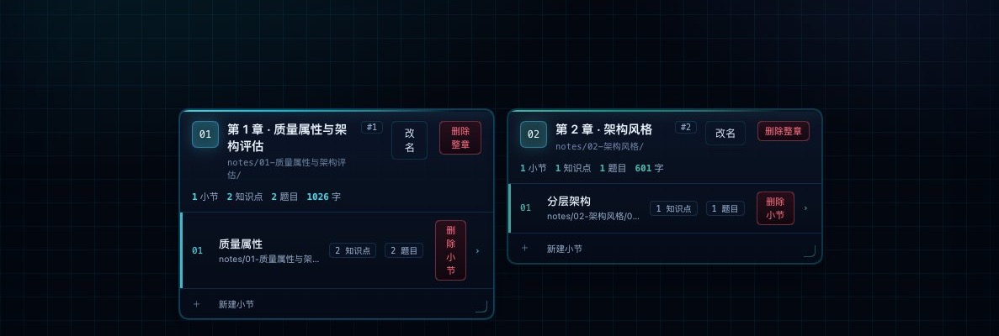
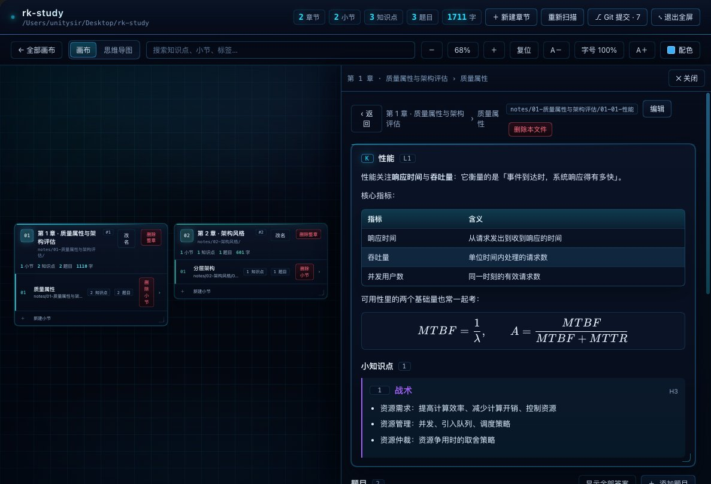
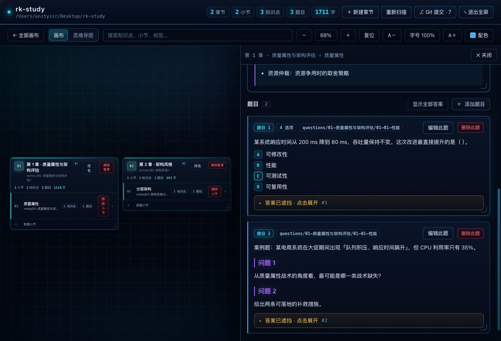
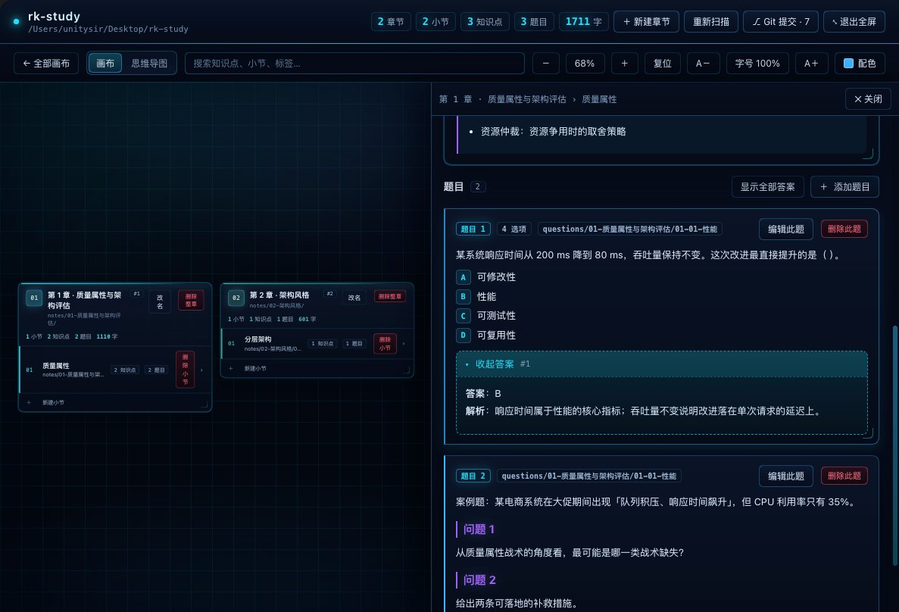
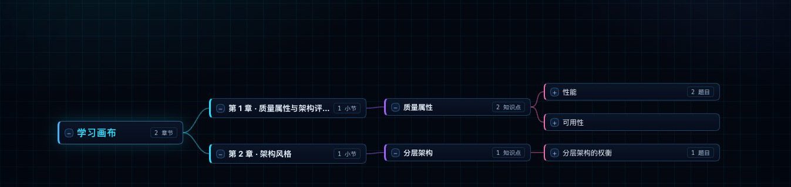
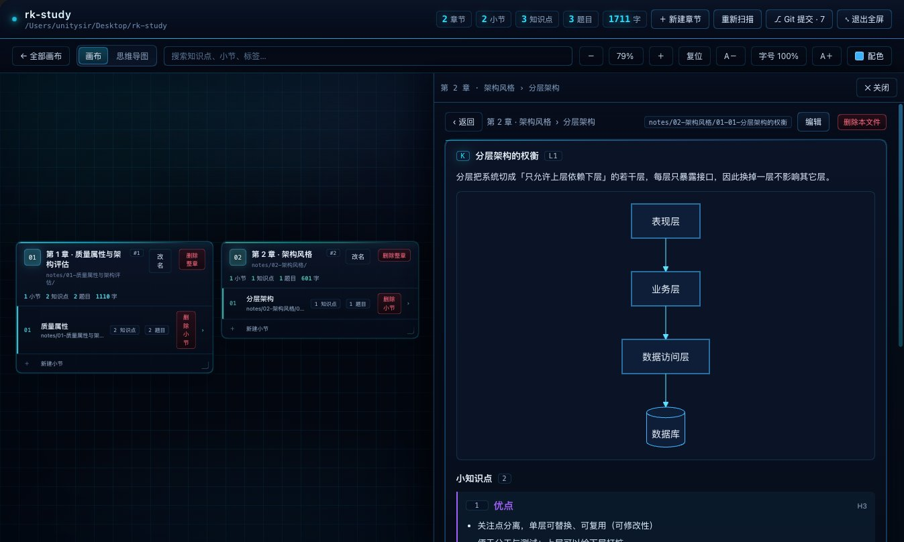
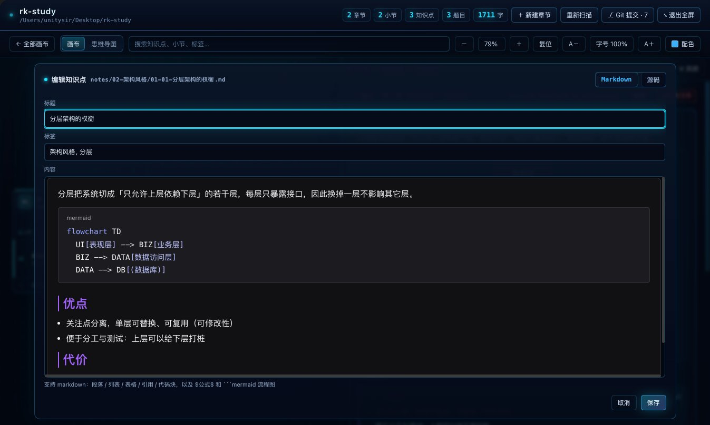
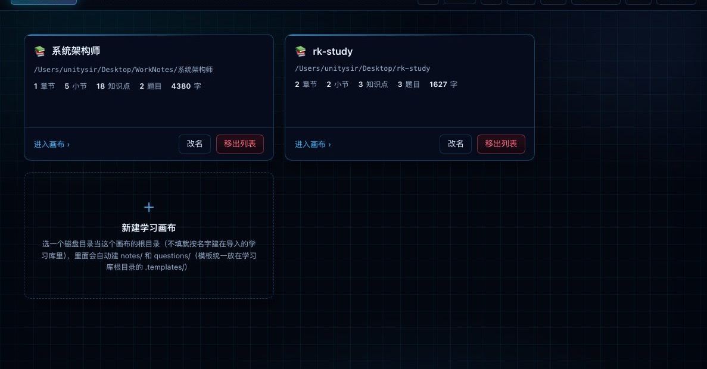

# 学习画布 · dsh-kp-notes

> 把一整个目录的 Markdown 笔记变成一张可以平移、缩放的卡片画布 —— **一个目录 = 一章，一章 = 一张卡**；知识点是卡片，题目自带答案遮挡，随手自测。

写给 [DeepSeek Harness](https://github.com/deepseek-ai/deepseek-harness) 的插件（宿主半 + 浏览器半）。笔记就是普通的 markdown 文件，留在**你自己的目录**里：插件不建数据库、不改你的文件格式，删掉插件笔记照样能读。渲染引擎与编辑器随插件分发，**不联网、不依赖 CDN、不需要构建**；界面中英双语，跟随宿主语言。

## 界面预览

| 画布：章节卡 → 小节 → 知识点卡片墙 | 知识点详情：真表格 + LaTeX 公式（KaTeX） |
| --- | --- |
|  |  |
| **题目：答案默认折成「▸ 答案已遮挡」** | **点开自测：答案 + 解析** |
|  |  |
| **思维导图：章 → 小节 → 知识点** | **正文里的 mermaid 流程图（本地渲染）** |
|  |  |
| **编辑知识点：笔记就是普通 markdown** | **多画布：一个目录 = 一块画布** |
|  |  |

## 特性一览

| | |
| --- | --- |
| **画布** | 章节卡排成一行、不换行，可自由平移 / 缩放（20% ~ 240%）；点小节在右侧展开知识点卡片墙 |
| **思维导图** | 同一份笔记切换成「章 → 小节 → 知识点 → 正文」的左→右树；正文按小标题拆成小知识点卡片，同一时刻只展开一个（手风琴） |
| **多画布** | 一级画布上每张卡 = 磁盘上一个笔记根目录（软考、别的考试、工作笔记各放一个，互不干扰）；画布清单 / 移出记录 / 字号配色主题跨浏览器同步 |
| **题目与自测** | 一个知识点配一个题目文件，一个文件可放任意多道（每道一个 `## 题目 N`）；答案默认折叠成「▸ 答案已遮挡」，点开自测；选择题 / 案例题两种题型可视化录入 |
| **富文本编辑** | 编辑器抽屉默认所见即所得（Milkdown：`/` 斜杠菜单、选区工具条），一键切回「markdown 源码 + 实时预览」；文件开头的 YAML 头不会被富文本碰坏；Milkdown 回吐 markdown 时会**防御性转义**（把正文里的 `_ ~ & [ \` \|`、行首标点写成 `\_ \~ …`），插件写回前会逐字验证「去掉后渲染完全一样」再去掉，`a\*b\*c`、行首 `\-` 这类真在当语法用的原样保留；`\$A_i\$` 这种成对转义的美元符号会还原成内联公式（`$A_i$`），题目 / 知识点弹窗与编辑器抽屉走同一套判官 |
| **公式与流程图** | 正文里直接写 LaTeX 与 mermaid，本地渲染；语法写错只在原地报错，不弹引擎那层关不掉的遮罩 |
| **输入助手** | 44 条公式模板 + 8 条结构 / 笔记 / 题目模板（模板本身就是两个可编辑的 markdown 文件），工具栏按钮 + 快捷键，外加一套自己实现的编辑键 |
| **配色与主题** | **插件配色**（默认，自带 15 套皮肤：科技蓝 + 14 套 Material Design）/ **跟随主题**（直接吃当前 DeepSeek Harness 主题的底色 / 文字 / 强调色，不覆盖平台主题）两档；还能让每张卡各用一色；整体字号 85% ~ 160%；全屏专注模式 |
| **Git** | `⎇ Git 提交` 一次提交整个学习库（提交前自动 `git pull --no-rebase`），可 `✦ AI 生成` 提交信息；绝不 `reset` / `checkout` / `rebase`，冲突了就停下来交给你 |

## 安装

需要 [DeepSeek Harness](https://github.com/deepseek-ai/deepseek-harness)（桌面版或 Web 版；开发环境为 0.2.0-rc.2）。插件**没有 npm 依赖、也不需要构建** —— KaTeX / mermaid / zt-react-milkdown 都在 `plugin/dsh-kp-notes/vendor/` 里随包分发。

**从本仓库安装（现在就能用）**：先把仓库克隆到本地，然后

```sh
dsh plugin --profile <profile 名> add link:/绝对路径/rk-study/plugin/dsh-kp-notes
```

**从 GitHub 直装（不用克隆）**：

```sh
dsh plugin --profile <profile 名> add github:UnitySirx/dsh-kp-notes#path:plugin/dsh-kp-notes
```

> pnpm ≥10 会提示 `The git-hosted package … has to be built but the build scripts were ignored` —— 这个包没有构建步骤（没声明 `prepare` / `build`，也没装任何依赖），忽略这条警告即可。

**从 npm 安装**（包尚未发布；发布后把 `link:` 那段换成包名即可）：

```sh
dsh plugin --profile <profile 名> add dsh-kp-notes
```

装好后在「插件」面板里把 **`dsh-kp-notes`**（内部名 `rk-study`）打开 —— `plugin/dsh-kp-notes/package.json` 里声明了 `dsh.bundle.patch`（Node 半）与 `dsh.client`（浏览器半），宿主会把两半一起挂上；入口是**左侧边栏面板列表里的「知识点笔记」**（英文界面下是 `Knowledge Notes`，图标 `plugin/dsh-kp-notes/icon.svg`）。三种装法装完都一样。

**改完代码怎么生效**：改 `plugin/dsh-kp-notes/client/` 或 `client.js` 后刷新页面（`⌘R`）即可；改 `host.js` / `lib/` 下任何文件要把 `?v=N` 与 `client.js` 的 `MODULE_VERSION` 一起 +1，见「五、插件实现」开头。`cordis.patch.yml` 现在是发布形态的包名 `dsh-kp-notes`（没有 `?entry=N` 缓存戳）⇒ **关开 bundle 不会重新 import 宿主模块，宿主半的改动要重启 DeepSeek Harness 才生效**；客户端那半关开一次 bundle（或改个按钮文案）就生效。

## 快速开始

1. **准备一个目录当画布**（放插件目录外面，例如 `~/Notes/系统架构师/`）。面板右上角的 `＋ 新建学习画布` 会帮你建好 `notes/` 与 `questions/` 两个子目录，也可以自己手工建。
   - 想一次管多张画布：先建一个空目录（比如 `~/Notes/`），用面板右上角的 `⇪ 导入目录` 把它当成**学习库**，之后新建的画布都挂在它下面。
2. **写笔记**：在 `notes/` 下按约定建目录与 markdown 文件（见下一节），或者直接在面板里点 `＋ 新建章节` / `＋ 新建小节` / `＋ 新建知识点` / `＋ 添加题目`。
3. **看画布**：章节卡 → 点小节 → 右侧知识点卡片墙 → 点知识点看说明与题目；答案默认遮挡，点一下展开。

> 笔记目录里**不写任何配置文件**（只有学习库那一级会有一份 `.config/rk-study.json` 和共用的 `.templates/`）：字号、配色、视野这类状态只存在浏览器与学习库里，进 git 的永远是纯粹的 markdown。

## 目录

- [一、目录结构与命名约定](#一目录结构与命名约定)
- [二、三类文件长什么样](#二三类文件长什么样)
- [三、直接在插件里写](#三直接在插件里写)
- [四、画布操作](#四画布操作)
- [五、插件实现](#五插件实现)
- [六、主题与配色](#六主题与配色)
- [七、Git 提交](#七git-提交)
- [第三方资源与许可](#第三方资源与许可)

下面开始，就是把「磁盘上的文件」和「画布上的卡片」一一对应起来的最完整说明。

## 一、目录结构与命名约定

| 文件系统 | 插件里 |
| --- | --- |
| `notes/` 下的一个目录 | 一个大章节（画布上的一张章节卡）；**目录名 = 章节名**，卡上点「改名」即可重命名（目录本身跟着改） |
| `notes/<章>/<NN>-标题.md` | 该章的第 NN 个小节（只放标题 + 小节导读） |
| `notes/<章>/<NN>-<MM>-标题.md` | 小节 NN 下的第 MM 个知识点（一个文件 = 一张知识点卡片） |
| `questions/<章>/<同名文件>.md` | 上面那个知识点的题目（一个文件可放多道，每道题一个 `## 题目 N`） |

```
<画布根目录>/           ← 例如 ~/Notes/系统架构师/
├─ notes/
│  ├─ 01-架构设计基础/
│  │  ├─ 01-架构风格与架构视图.md                ← 小节 01（标题 + 导读）
│  │  ├─ 01-01-五大类架构风格.md                 ← 知识点（只有说明，不写题）
│  │  ├─ 01-02-易混淆对比.md                     ← 知识点
│  │  └─ 02-架构评估方法与ATAM.md                ← 小节 02
│  └─ 02-质量属性与战术/…
└─ questions/
   └─ 01-架构设计基础/
      ├─ 01-01-五大类架构风格.md                 ← 知识点 01-01 的题目
      └─ 02-04-敏感点-权衡点-风险点.md            ← 知识点 02-04 的题目
```

> 挂在**学习库**下的画布（父目录里还有别的画布，例如 `~/Notes/系统架构师/`）自己**不会**有 `.templates/`、也**不会**有 `.config/`：模板统一放学习库根目录那一份，设置在库级的 `.config/rk-study.json` 里（见下面「学习库」与「设置存在哪」）。只有**自带根目录的画布**（不挂在任何学习库下）才会在它自己目录下建 `.templates/`。

`notes/`、`questions/` 是**相对画布根目录**的路径（不是相对插件仓库）。插件仓库里没有这两个目录：一个画布一个根目录，各自独立、也各自独立 `git`。

**配对规则**：题目文件与知识点文件**路径同名**（`notes/X/Y.md` ⇄ `questions/X/Y.md`）即自动配对；也可以在题目文件的 frontmatter 里写 `point: notes/X/Y.md` 显式指定。配不上的题目文件不会丢，会挂到对应章节目录下并在目录 JSON 的 `orphanQuestions` 里列出。

命名规则（不满足时会退化，不会丢文件）：

- **第一个数字 = 小节号**，决定这个文件挂在哪一小节下；**第二个数字 = 小节内的知识点序号**。
- 兼容旧写法：文件名里出现 `例题` / `题目` / `案例` / `错题` / `真题` / `习题` / `已做` 等片段也判为**题目文件**，所以历史文件不用改名。
- 都不是、且没有第二个数字 → 判为**小节文件**（自己一行）。
- 想在 frontmatter 里显式指定，可写 `type: point`（知识点）/ `type: question`（题目）/ `type: section`（小节）；不写就按文件名推断。
- **章节名 = 目录名去掉 `01-` 这类序号前缀**；章节序号也来自目录名，所以「第 2 章 · 质量属性与战术」= 目录 `notes/02-质量属性与战术/`。像本仓库 `README.md` 这样直接放在画布根目录下的文件，属于「根目录」那一章，章名取其中第一个小节的标题。
- 没有对应小节文件的独立知识点不会消失：会作为一个小节单独列出来。

## 二、三类文件长什么样

### 小节文件（`notes/<章>/<NN>-标题.md`）

```markdown
---
title: 架构评估方法与 ATAM
type: section
order: 2
tags: [ATAM, 架构评估]
---

# 架构评估方法与 ATAM

考点集中区：SAAM / ATAM / CBAM / SAEM 的区别、ATAM 的四阶段九步骤、效用树的三层结构。
```

小节文件只放**标题 + 导读**，内容都拆到知识点文件里。

### 知识点文件（`notes/<章>/<NN>-<MM>-标题.md`）

```markdown
---
title: 敏感点 / 权衡点 / 风险点
type: point
order: 4
tags: [ATAM, 质量属性]
---

# 敏感点 / 权衡点 / 风险点

| 类型 | 含义 | 影响范围 |
| --- | --- | --- |
| 敏感点 | 为实现某一个质量属性，对某架构决策特别敏感的点 | 影响 1 个属性 |
```

- **按目录定性质**：`notes/` 下的内容一律是**知识点**，`questions/` 下的内容一律是**题目** —— 不会从笔记里「抽」出题目，也不会把笔记切成子卡片。
- 知识点卡片上显示的是**提取出来的说明文字**，不是 markdown 源码；表格会转成文字摘要。
- 一个知识点文件（`# 标题` 或 `## 标题` 开头）就是**一张知识点卡片**：里面出现的所有标题（`##`、`###`、`####` ……）都留在正文里，**不会再拆成画布上的子卡片**。
- 正文里的标题**按级别分大小与颜色**：`#` 20px/800 渐变白蓝、`##` 17px/700 + 左侧 3px 色条、`###` 15px/700 + 2px 色条、`####` 13.6px、`#####` 12.8px + 字距、`######` 12px + 字距（色条颜色 = 标题色）。2~6 级各给一个**鲜艳**的颜色、互不撞色：**青 → 紫 → 粉 → 琥珀 → 绿**，默认皮肤写死在 `--rk-t2 … --rk-t6` 五个变量里；换「配色」时按主色色相旋转 `+0 / +62 / +128 / +200 / +268` 重算这五个值，所以既鲜艳又跟整体配色协调。正文、实时预览、详情页走同一套；**小知识点**的标题、左侧色条、序号块也按它自己的级别取同一组颜色（另有 16 / 14.8 / 13.4 / 12.8 / 12.3px 五档字号），右侧角标写着它是几级。
- 但详情页会把正文里的**小标题**显示成**小知识点**：取正文中**最浅的那一级**标题（只有 `###` 就按 `###`，同时有 `##` 与 `###` 就按 `##`）当分界，标题前的内容是引子，每个标题带自己下面那段正文，上面加一行 **小知识点 N**；编号行（`1.` `2.` …）不算分界，留在它所属的小知识点里。代码块里的 `#` 不会被当成标题。写笔记时想在详情里分几小点，就用小标题分段。
- 知识点详情页里的**题目**来自 `questions/` 目录（用题目文件 frontmatter 的 `point:` 指到这个知识点），或者你在详情页点 **＋ 添加题目** 加进去的；两者都会写进 `questions/`。

### 题目文件（`questions/<章>/<同名文件>.md`）

```markdown
---
title: 敏感点 / 权衡点 / 风险点 · 题目
type: question
order: 4
tags: [ATAM, 质量属性]
point: notes/01-架构设计基础/02-04-敏感点-权衡点-风险点.md
---

# 敏感点 / 权衡点 / 风险点 · 题目

## 题目 1

在 ATAM 评估中，若某个架构决策同时影响到系统的安全性和性能，则该决策点被称为（ ）。

A. 敏感点
B. 权衡点
C. 风险点
D. 非风险点

**答案**：B
**解析**：敏感点影响一个质量属性，权衡点影响多个质量属性。

## 题目 2

同一道题里还可以带 `### 问题 1`、`### 问题 2` 这样的子问题（案例题常用）。

**答案**：……
```

- 一个题目文件可以放**任意多道**题，每道题一个 `## 题目 N`，卡片样式与遮挡规则完全一样 —— **没有「例题 / 已做题目」之分，一律叫题目**。
- 题目标题写在几级都可以（`## 题目 1` 最常用，`# 题目 1` / `### 题目 1` 也认），检测与删除用的是同一套判定：界面上一道题，就一定能删掉。文件里**没有**任何题目标题时不会凭空造题，界面显示「题目 0 · 这个知识点还没有题目」，点 `＋ 添加题目` 补一道标准的即可。
- 题目**只出现在知识点详情页里**，紧跟在知识点说明下面 —— 题目只属于知识点，不属于小节。
- 题目下面自带 `### 问题 1` 这类子标题也可以，题干与答案会被正确切开。
- **两种题型自动识别**，也决定 `＋ 添加题目` 打开哪个表单：
  - **选择题** —— 题干下面有 `A. …` 到 `D. …` 若干行选项，`**答案**：B` 只写字母，`**解析**：…` 另起一行；
  - **案例题** —— 没有选项行，`**答案**：` 后面就是答案正文（可以带 `### 问题 N` 子标题、列表、表格）。
  - 表单只管这些**约定好的位置**（题干 / 选项 / 答案行 / 解析行），答案正文里的 markdown 原样保留，不会被插件改写。

### 答案遮挡

- 答案写在题干后面即可，`**答案**：B`、`答案：B`、或另起一个 `## 答案` 小节都认。
- 从「答案」那一行往后（含解析）默认折叠成 `▸ 答案已遮挡 · 点击展开`，点一下展开。
- 知识点详情页的**「题目」那一行**（和 `＋ 添加题目` 并排）有「显示全部答案」，一次展开本知识点的全部答案。
- 选择题的 A/B/C/D 选项自动识别、按行排版。

### 公式与流程图

正文（知识点说明、答案、导读……）里可以直接写 LaTeX 公式和 mermaid 流程图，插件会渲染出来：


| 写法 | 渲染成 |
| --- | --- |
| `$A = \frac{MTBF}{MTBF + MTTR}$` | 行内公式 |
| `\(x^2 + y^2 = z^2\)` | 行内公式（另一种写法） |
| 单独成段的 `$$ … $$` | 居中的块级公式 |
| ` ```math ` / ` ```latex ` 围栏 | 块级公式 |
| ` ```mermaid ` 围栏 | 流程图 / 时序图 / 状态图等 mermaid 图 |

- 渲染引擎（KaTeX 0.16.47 + mermaid 11.17.2）作为**静态资源随插件分发**（`plugin/dsh-kp-notes/vendor/`，约 7.1 MB：KaTeX 292 KB + mermaid 3.4 MB + zt-milkdown 3.1 MB），由插件自己的路由 `/rk-study/vendor/*` 直出；页面**第一次**遇到公式/图时才去取，之后走浏览器缓存 —— 不联网、不依赖 CDN、不需要构建。
- 只认识「像公式的」`$…$`：`价格 $100, 折扣 $20`、`$5 到 $10` 这类货币写法会**原样显示**，不会被当成公式吃掉。
- 引擎取不到时**不会白屏**：公式退回显示原始 `$…$`，流程图显示红框提示 + 原始代码，正文照常可读。
- 语法写错时**不弹 mermaid 自带的那个红框**（它是引擎直接挂到页面 `body` 上的，React 管不到，会一直挡着关不掉）：只在原地显示「流程图渲染失败：Parse error on line N」加出错的源码，改好语法自动重画。做法是 `mermaid.initialize({ suppressErrorRendering: true })` 让引擎先自己清理再抛错，再加一层按 id 兜底删临时节点的保险。
- **边写边看**：编辑器抽屉默认是**富文本所见即所得**（Milkdown，见下条），点右上角「源码」切回「markdown 源码 + 实时预览」的左右分栏；编辑知识点 / 题目的弹窗仍是左右分栏，右边跟着左边实时渲染 —— 写公式和流程图不用先保存再刷新。
- **YAML 头不会被富文本碰到**：笔记文件开头那段 `---` … `---` 元数据（`title` / `type` / `tags` / `order`）只在源码模式里显示和编辑，富文本里看不到也改不到，保存时再原样拼回去（抽屉头会亮一个「YAML ✓」小标）—— 所以打开富文本改正文、随手保存，不会把元数据变成一段普通文字。富文本回吐的正文还会顺手清掉空段落留下的 `<br />` 和行尾空格，头后面固定留一个空行。
- **编辑器也是随插件分发的静态资源**：`plugin/dsh-kp-notes/vendor/zt-milkdown/` 里放的是 `zt-react-milkdown@0.1.32`（MIT，Milkdown 内核；`zt-milkdown.js` 1.6 MB + `zt-milkdown.css` 1.6 MB，含内联字体）。加载方式是自己写的小加载器 `client/milkdown.js`：注入样式 → `fetch` 回 CJS 文本 → 用 `new Function('require','module','exports', code)` 执行，`require` 只映射 `react` / `react-dom` / `react-dom/client` / `react/jsx-runtime`（都用宿主那一份，`react-dom/server` 给个空壳）—— 所以**不需要 npm 安装、不联网、不打包**。编辑器脚本取不到（文件缺失、浏览器拦截）时自动停在源码模式，不会白屏。

## 三、直接在插件里写


| 位置 | 操作 | 结果 |
| --- | --- | --- |
| 画布右上角 | **＋ 新建章节** | 弹出输入框，只输入**章节名**；创建目录 `<父目录>/<NN>-<章节名>/`（不生成任何文件，空章节也会立刻出现在画布上） |
| 章节卡右上角 | **改名** | 改章节名 = 改目录名（序号前缀保留）；`questions/` 下的同名题目目录一起改名，题目文件里的 `point:` 前缀同步更新 |
| 章节卡底部 | **＋ 新建小节** | 创建 `<章节目录>/<NN>-<标题>.md`（`type: section` + 导读） |
| 小节页右上角 | **＋ 新建知识点** | 创建 `<章节目录>/<NN>-<MM>-<标题>.md`（`type: point` + 说明骨架） |
| 知识点页 · 题目分组 | **＋ 添加题目** | 弹出**可视化表单**（选择题 / 案例题两种），不用写 markdown |
| 每道题右上角 | **编辑此题** | 同一个表单，字段已经从文件里解析出来，改完保存即写回该题目文件 |
| 题目表单 · 选择题 | 题干 / 选项 A–D / 正确答案（点圆点）/ 解析 | 选项可增删（`＋ 加选项`、每行 `删除`）；留空的选项保存时丢掉，字母按顺序重排 |
| 题目表单 · 案例题 | 题干 + 答案正文（markdown） | 多问案例题就按「问题 1 / 答案 / 问题 2 / 答案」往下写，原样保存、原样读回 |
| 题目表单 / 知识点表单 | 左栏写、右栏**实时预览** | 两个弹窗都是大号左右分栏：左边是表单，右边实时渲染 —— 题干/正文里的 `$公式$` 与 ` ```mermaid ` 流程图边写边出，选项与答案按写入文件的样子预览。**里面的 markdown 字段（题干 / 答案 / 解析 / 正文）默认就是 Milkdown 所见即所得**（`/` 斜杠菜单、选区工具条都在），标题行右侧 **Markdown / 源码** 一键切换（源码模式就是 markdown 源码框 + 输入助手工具栏）；知识点弹窗的 **Markdown 模式不占实时预览**（源码框整栏通铺、编辑器更宽），切到 **源码** 才并排显示实时预览 |
| 题目表单底部 | **保存并继续添加**（新建时） | 存下这一题、清空表单、继续录下一题 |
| 知识点页 | **编辑** | 弹出**可视化表单**：标题 + 标签 + 内容（正文 markdown），不用面对 frontmatter；改标题会同时改写 frontmatter 的 `title:` 与正文里的 `#` 标题，标签只在「整篇文件就是一个知识点」时出现（多知识点的小节文件里标签属于文件，不在单个知识点上） |
| 小节页 | **编辑** | 抽屉里直接改该小节文件的 markdown |
| 编辑器抽屉 | **插入题目模板**（只在题目文件里） | 在当前光标处插入 `## 题目 N` 骨架；其它文件没有这个按钮 |
| 编辑器抽屉 | **Markdown / 源码** | 默认是**所见即所得**（Milkdown：标题、加粗、列表、表格、公式、代码块写的时候就是最终样子；`/` 斜杠菜单、选区工具条、`⌘B` / `⌘I` 等由编辑器自己管）；点「源码」切回「markdown 源码 + 实时预览」左右分栏、抽屉收窄。编辑器自带查找替换面板、图片（链接）弹窗、表格操作、代码块语言选择；**标题按层级上色**（`#` 亮白、`##` 青、`###` 紫、`####` 粉、`#####` 黄、`######` 绿 —— 取的是「配色」那套 `--rk-t2..t6`，换配色跟着变，和预览 / 思维导图一致，`##` / `###` 还带左侧色条）；笔记的 YAML 头在富文本里不显示（抽屉头有「YAML ✓」），要改就在源码模式里改。脚本取不到时直接停在源码模式 |
| 新建小节 / 新建知识点 | **保存** | 抽屉里只有「目录（只读）+ 标题」两个输入框，回车或点保存即创建，随即关掉抽屉（不会自动打开编辑器）；新建后可在卡片上点 `编辑` 再写内容 |
| 编辑器抽屉（**源码**时）/ 题目表单 / 知识点表单（**源码**时） | 输入框上方那一排小按钮 | markdown 输入助手：加粗、斜体、行内公式、块级公式、表格、流程图、列表、引用、链接、代码，最右边两个下拉 —— **公式 ▾**（公式 / 符号两组）与 **模板 ▾**（结构 / 笔记 / 题目），点一条插进正文（详见下面「输入助手」） |
| 同上 | 快捷键 | `⌘B` 粗体、`⌘I` 斜体、`⌘M` 行内公式、`⇧⌘M` 块级公式、`⌘K` 链接、`⌘E` 行内代码、`Tab` / `⇧Tab` 整行缩进反缩进、`⌘S` 保存；另有一组**插件自己实现的编辑键**：`⌘/Ctrl + Z` 撤销、`⇧⌘Z` / `Ctrl + Y` 重做、`⌘/Ctrl + C` 复制、`⌘/Ctrl + X` 剪切、`Ctrl + V` 粘贴（`⌘V` 仍交给系统） |

> 三个弹窗（新建 / 改名章节、题目表单、知识点表单）**只有点「取消」或按 `Esc` 才关闭**：点到弹窗外面的灰底不会误关，正在写的内容不会因为手滑点空而丢掉。弹窗里 `⌘S` / `Ctrl+S` 就是保存。

### 插入图片（落盘，不写 Base64）

编辑器（富文本 / 题目表单 / 知识点表单）里插的图**不再写成一长串 Base64**，而是交给插件落成真文件：

- **放哪**：这篇笔记所属**小节**旁边，与那个 `<小节文件>.md` 同级的 `<小节编号>.assestfiles/` 目录（例：`notes/01-计算机硬件/s0001.assestfiles/`）。编号就是插件给每个小节发的 `s0001` 号（见「编号（uid）」一节）。
- **叫什么**：`<小节编号>-<序号>.<扩展名>` —— `s0001-1.png`、`s0001-2.png` …… 序号自动往后排，同名不会互相覆盖。
- **笔记里写什么**：只写**相对路径**，例如 ``；在题目文件（`questions/` 那一侧）里插的图落到同一个素材目录，路径写成 `../../notes/01-计算机硬件/s0001.assestfiles/s0001-1.png` —— 因为相对的是**这篇笔记自己**的位置。
- **显示**：卡片 / 思维导图 / 实时预览 / 编辑器都会把这段相对路径换成 `/rk-study/media?path=…` 去取字节，所以写进去立刻能看到图；插件之外（别的 markdown 编辑器、导出、搬走整个库）也照样认，因为它就是普通相对路径。
- **删图不删文件**：从正文里删掉图片只删 markdown 里那一行，盘上的文件留着（想删就去那个目录删）。名字带序号、只增不改，所以图片可以放心长缓存。
- **支持的格式**：`png` / `jpg` / `jpeg` / `gif` / `webp` / `avif` / `bmp` / `svg`，单张上限 24 MB。
- **新建时例外**：新建小节 / 知识点时文件还没落盘，此时插图仍是编辑器内置的 Base64；保存之后再插图就走上面这套了（把之前的 Base64 图删掉重插一次即可）。
- `*.assestfiles/` 目录不会被扫描成章节，画布上不会多出奇怪的卡片。

### 输入助手（快捷键 + 公式模板）

每个 **markdown 源码框**（编辑器抽屉切到「源码」、题目 / 知识点表单切到「源码」）上方都有一排小按钮，写笔记时不用手打符号 —— 它按光标位置插入，所以富文本模式里不显示（富文本用 `/` 菜单和选区工具条）：

| 按钮 | 插入什么 | 快捷键 |
| --- | --- | --- |
| **B** / *I* | 选中文字加粗 / 斜体（没选中就插占位符，光标停在中间） | `⌘B` / `⌘I` |
| **∑** | 行内公式 `$…$` | `⌘M` |
| **∫** | 块级公式 `$$…$$`（单独一段） | `⇧⌘M` |
| **表格** | 3×3 markdown 表格骨架 | — |
| **流程图** | ` ```mermaid ` + `flowchart TD` 骨架 | — |
| **列表** / **引用** / **链接** / **代码** | 无序清单 / `>` 引用 / `[文字](url)` / 行内代码 | — |
| **公式 ▾** | 公式库菜单，四组：**公式**（行内 / 块级 / 分式 / 求和 / 积分 / 极限 / 根号 / 上标 / 下标 / 方程组 / 矩阵）、**希腊字母**、**关系与运算符**、**箭头与集合** —— 一条就是一条，点哪个插哪个 | — |
| **模板 ▾** | 其余模板菜单：**结构** / **笔记** / **题目** 三组，点一条插进正文 | — |

**编辑键（撤销 / 重做 / 复制 / 剪切 / 粘贴）也由插件自己实现**，因为有些环境（Tauri 打包后的 WKWebView）不把 `⌘C` / `⌘V` / `⌘X` / `⌘Z` 交给网页、应用自己的原生菜单又不接管，这四个键就整个失效：

- `⌘/Ctrl + Z` 撤销、`⇧⌘Z`（或 `Ctrl + Y`）重做 —— 走 `document.execCommand('undo' / 'redo')`，用的是浏览器自己那份撤销栈，所以打字、粘贴、输入法上屏都能一步步退。
- `⌘/Ctrl + C` 复制选中、`⌘/Ctrl + X` 剪切选中 —— 走 `execCommand('copy' / 'cut')`：剪贴板、撤销栈、`input` 事件都和原生一致（受控 textarea 也能同步到 React 状态）。
- `Ctrl + V` 粘贴 —— `execCommand('paste')` 被浏览器禁掉，只能读 `navigator.clipboard.readText()`，所以**只有 Ctrl+V 走插件**；`⌘V` 仍交给系统（避免 WKWebView 的权限弹框把本来好用的 `⌘V` 弄坏）。
- 三条都只在 `execCommand` 返回 `true` 时才 `preventDefault`：命令不被支持就原样交回系统，本来能用的环境不受影响。

**模板放在两个单独的 markdown 文件里**：`.templates/公式模板.md`（`公式 ▾` 菜单）和 `.templates/Markdown模板.md`（`模板 ▾` 菜单）—— **一个文件对应一个菜单**，各改各的。模板统一放在**学习库根目录**的 `.templates/`（库里所有画布共用这一份，各画布自己不再存）；只有自带根目录、不挂在学习库下的画布才放在它自己的 `.templates/`。老画布原来放在 `notes/.templates/` 的继续认（那里有文件就用那里的）。

- 目录名以 `.` 开头，所以**它们不会出现在画布上**（扫描时跳过点开头的目录），也**不会被当成一章**。它们在**学习库根目录**（不在任何画布里，也不在 `notes/` 里）；面板的 `⎇ Git 提交` 是在**一级画布（根节点）**上按**整个学习库**提交的（`git add -A`），所以它们会一起进版本库 —— 除非你自己的 `.gitignore` 把它们排除掉。
- 文件格式只有三条规则：`##` 是分组名，`###` 是模板名，模板名下面**紧跟的第一个代码块**里的内容就是插入到正文的文本；模板内容本身想带代码块（比如流程图），外面用四个反引号包起来。
- **一条只放一个公式或一个符号**：菜单里每条的名字都带着它的 LaTeX 命令（`积分 \int`、`α \alpha`、`≤ \le`），鼠标停在上面会显示要插入的完整代码，点下去只插这一条 —— 不会一次插一串。
- 想加自己的公式就写进 `公式模板.md`（照 `## 公式` / `## 希腊字母` / `## 关系与运算符` / `## 箭头与集合` 分组放，一条一个 `###`），想加结构骨架就写进 `Markdown模板.md`；保存后回到编辑器点对应菜单里的 **重新读取** 就能看到（工具栏每次打开时也会重新读一次）。要加第三类菜单得改代码（宿主 `lib/templates.js` 的 `TEMPLATE_FILES`）。
- 加一条自己的公式：在文件里照着写 `### 名字` + 代码块并保存，回到编辑器点 **模板 ▾ → 重新读取** 就能看到（工具栏每次打开时也会重新读一次）。
- 某个文件被删了也没关系：**那个菜单**底部会出现 **建模板文件**，点一下按内置默认库重新生成它（公式模板 44 条 —— 公式 11 条：行内 / 块级 / 分式 / 求和 / 积分 / 极限 / 根号 / 上标 / 下标 / 方程组 / 矩阵，希腊字母 17 条，关系与运算符 8 条，箭头与集合 8 条；Markdown模板 8 条 —— 结构 4 条：表格 / 流程图 / 无序清单 / 引用块，笔记 2 条：知识点骨架 / 小节骨架，题目 2 条：选择题骨架 / 案例题骨架）。
- **编辑模板文件** 在菜单底部，点它直接在抽屉编辑器里打开**这个菜单对应的那个文件**，改完 `⌘S` 保存（换文件时编辑器会重新挂载，不会残留上一个文件的内容）。

### 删除（不真删：一律移到当前画布的 `.remove/`，都有二次确认）

**插件里的每个「删除」都是移动**：目标被 `rename` 到**当前一级画布根目录下的 `.remove/`**，**一次删除 = 在这里新建一个日期桶目录**（名字就是当天的 `YYYYMMDD`，例如 `20261004`），桶里保留原来的相对路径结构（删掉章节 `notes/01-第一章`，桶里就是 `notes/01-第一章/` 与 `questions/01-第一章/`）。桶与桶互不相干，所以**删两次就留两份，谁也不覆盖谁**（同一个章节删两次，第二次进的是新桶，第一次那份原样还在），也**不会把不同次的删除混进同一条路径**（先删整个章节、之后又删重建章节里的某个知识点 —— 后者进它自己那个新桶，不会落进上次那份章节备份里）。同一天里再删一次，名字往后排成 `20261004-2`、`20261004-3`（桶名只到「天」，一天里删几次就有几个桶；文件本身的修改时间由 `rename` 原样保留，想知道具体几点几分看它就行）。`.remove` 以点开头，扫描时跳过，所以它不会出现在画布、思维导图或搜索里。要找回：在画布根目录下打开 `.remove/`，挑日期对得上的那个桶，把东西移回原位即可；`rm -rf .remove` 就等于真正清空回收站。

**编号（uid）：每个一级画布与章节都有一个自己的、永不复用的编号**，形如 `c0001`（画布）/ `h0007`（章节）/ `s0012`（小节）/ `p0031`（知识点）。编号**不写进文件名或目录名**（文件怎么排、卡片长什么样一个字都没变），只当身份用：目录类实体（画布 / 章节）的号记在**学习库**的 `.config/rk-study-uids.json` 里（号池，就一张表 `{ "version": 1, "uids": { 绝对路径: 编号 } }`），发号计数器 `seq` 仍跟界面设置一起放在 `.config/rk-study.json`，跟画布放在哪个目录、叫什么名字无关。删掉之后号**不回收**：把同名的章节/画布在原地重建，拿到的是**新号**（旧号只留在它自己的备份里），所以「先删 02 再建一个」不会让两个不同时期的东西共用一个身份。号会跟着实体走 —— 章节改名、画布改名（重命名目录）都是**搬号**，身份不变；章节被删除或画布被「移出列表」时，被带走的号会连同文件一起写进那个桶里的 `.rk-uids.json`（`{"at": …, "uids": {绝对路径: 编号}}`），想恢复时认得回来：把目录搬回原位（被移出的画布还要在插件里重新导入一次），下次扫描就会**按路径把原来那个号认回来** —— 恢复的是原身份，不是新号；同一个路径在多个桶里都留过号时，以最近一次删除留下的为准。老笔记不用迁移：第一次扫描到没有号的章节就会自动补上；小节与知识点另走一条更省事的路 —— 号就写在 markdown 的 frontmatter 里（`uid: s0012`），跟着文件内容走，所以改标题、挪位置、连文件名一起改都不丢。**没有号的老笔记也不会被改文件**：扫描时先把号按路径登记进号池（界面上立刻就有号可用），等这个文件下次被插件保存，号才写进它的 frontmatter，号池里那条按路径记的账同时摘掉（号从此跟着内容走，路径再变也不丢）。插件保存时取号的顺序是：文件里已有的 → 盘上旧文件里的（前端重建头部把 `uid` 弄丢也能认回来）→ 扫描时登记的号池 → 都没有才发新号；题目文件本身不发号，但**每一道题**有自己的号 —— 挂在它那个块的标题**下一行**（`<!-- rk-uid: q0001 -->`，渲染出来的笔记里看不见；单独一行是必须的，因为重排 `## 题目 N` 会重写标题行）；改题干、换选项、整段重排都不动它，删掉一道题时标记跟着那段原文一起进 `.remove`，号同时记进计数器（不再发放）。扫盘结果和接口里也带着号：`/rk-study/notes` 返回的 `chapters` / `sections` / `points` 每一项都有 `uid` 字段（章节的号在扫描时补上，小节 / 知识点直接读它文件里的），所以客户端想显示编号可以直接用。**号池为什么单独一个文件**：`rk-study.json` 从此只留界面设置（字号、配色、画布清单）与发号计数器 `seq`，这张随时在长、只有插件自己用得到的号表放旁边 `rk-study-uids.json`；老版本把 `uids` 混在 `rk-study.json` 里的那些库**不用手动改** —— 插件照读老键，并在下一次发号 / 认号时把整张表写进号池文件、再把老键从 `rk-study.json` 里摘掉（一次自动迁移，号一个都不变）。**移出列表的墓碑同样待遇**：它按库里移出过的画布条数长，也住在同目录自己的文件 `rk-study-removed.json` 里（`{ "version": 1, "removed": [绝对路径] }`），老版本混在 `rk-study.json` 里的 `removed` 照读、第一次写时自动搬过去并把老键摘掉。

| 位置 | 按钮 | 移到 `.remove/<桶>/` 里的是什么 |
| --- | --- | --- |
| 章节卡右上角 | **删除整章** | `notes/<章>/` 整个目录 + `questions/<章>/` 同名题目目录（含其下所有小节 / 知识点 / 题目文件），根目录章节不可删 |
| 小节行 | **删除小节** | 该小节文件 + 该小节下的全部知识点文件（`NN-MM-*.md`）+ 这些知识点在 `questions/` 下的题目文件 |
| 知识点卡片底部 | **删除知识点** | 该知识点文件 + `questions/<章>/<同名文件>.md`（两侧同步移动） |
| 题目卡片右上角 | **删除此题** | 题目文件本身不动：被删掉的这一段 markdown 另存成 `.remove/<桶>/<题目文件路径>.removed-<题号>.md`（首行注释写明从哪个文件、第几题删的；同一题删两次就是两个桶里各一份，不覆盖），再重写剩下的题目 |
| 小节页 / 知识点页 / 编辑器 | **删除本文件** | 当前打开的这个文件（笔记文件同样连带移动配对题目文件） |

点一次按钮会在原处浮出「确认删除？ / 取消 / 删除」，再点「删除」才真正执行。确认条是**绝对定位浮层**，不占布局 —— 所以列表里的按钮不会因为多出这行字而换行或位移，**同一个位置连点两下第二次点到的仍然是「删除」**（早先的写法会把按钮挤到下一行、让第二次点空或误点「取消」）。执行后自动回到章节图并刷新，提示条写「已移到 .remove/<桶>/ · <路径>」，并写明连带处理了几个关联文件。

> 配对规则：`notes/X/Y.md`（知识点）与 `questions/X/Y.md`（该知识点的题目）是同一实体的两侧，动任何一侧都会连带处理另一侧；直接操作题目文件（API 的 `{action:'delete', path:'questions/…'}`）只动题目文件本身，知识点文件保留。
> 画布自己也有同类操作：一级画布卡上的 **移出列表** 是把这个画布目录移到**它同层**的 `.remove/` 里（见下一章）。

### 回收站（工具条上的 `♻ 回收站`：把删掉的东西搬回来）

上面那些「删除」都不真删，东西都在 `.remove/<日期桶>/` 里 —— 工具条上的 **`♻ 回收站`** 就是它的界面，而且**只有两层有它**：

- **根画布（还没进任何画布）**：列的是**被「移出列表」的整只画布**。画布目录躺在它**上一层目录**的 `.remove` 里（学习画布可以散在不同目录），所以这层不是一个目录一只，而是**把当前根、它上一层、以及画布列表里每张画布的目录各自上一层都算上**（`listRootBins`），把这些 `.remove` 里的桶合起来按日期排；当来源不止一只目录时，桶头会多一行 **`来自 <目录>`**，免得两个目录下的同名桶看混。恢复时按这条记录**自己那只桶**所属的目录落回原位（号也认那只目录的号池）；恢复好的画布还会自动从「移出列表」的墓碑里放出来、重新登记进画布列表。
- **一级画布（走进某张画布之后）**：只看这张画布自己的 `.remove`，并把里面的记录**按章并成一条**（`listChapterBin`）—— `01-第一章` 一条，点 **`↩ 恢复整章`** 就把这一章（含里面被删过的小节 / 知识点 / 题目片段）整段合并回去（`restoreChapter`）。理由是你删东西时想找回来的通常是「那一章」本身，而不是散在几个日期桶里的同几个文件；同一章在不同日期删过几次，也都并到这一条上。

面板里每一条显示**它原来的路径**（按章聚合时就是章名）和**它自己的编号**（`h0007` / `s0012` / `p0031`…），右边一个 **`↩ 恢复`**。恢复就是把它 `rename` 回原位，**编号跟着回去**（恢复的是原身份，不是新号）。

题目是内容级删除，桶里存的是**一段片段**（`questions/01-第一章/01-01-知识点.md.removed-2.md`，带一行注释记着它从哪个文件、什么时候删的）。题目仓库 `questions/<章>/` 与笔记目录 `notes/<章>/` 是平行结构，所以在面板上它们**并进同一章**，点「恢复整章」时一起搬回来；搬回来只是把这个片段文件放回**原位旁边**（原文件不动），要回到题库里还得自己把内容贴回知识点文件 —— 插件不替你把题目插回去，免得序号 / 编号对不上。片段也带着它那道题的号，面板上看得见 `q0007`。

**原位已经有同名的文件时一律拒绝，绝不覆盖**（提示「原位已经有同名的东西，先给它改名或删掉再恢复」），桶里的东西原样不动。按章恢复（以及根画布那层恢复整只画布）走的是**合并**：原位缺什么就搬回什么，原位已经有的目录往下钻着补，只有原位存在**同名文件**时才跳过（跳过几条会写在提示里）。恢复干净之后空掉的桶会自己从回收站里消失（`.remove` 里就剩一个 `.rk-uids.json` 的话，连空掉的 `.remove` 一并收掉）。要彻底不要了，`rm -rf .remove` 就是清空回收站。

**老版本留下的 `.remove`**（2025 年那阵子）也认得：那会儿的写法是 `.remove/<那条记录当时的相对路径>`（例如 `.remove/senior-software-architect-review`、`.remove/notes/01-第一章`），**目录自己就是被搬走的那条记录**，没有日期桶这一层。现在它会在面板上单独归成一只 **`旧格式`** 分组（桶名是空的，日期那栏显示「旧格式」），里面的每条记录跟新格式一样能 `↩ 恢复`；原位还在的那一层只当路径容器（往下钻着找真正被搬走的那些），所以一整个目录不会因为被误当成桶而拆成一堆假条目。老格式没有「桶」可以整桶合并，所以那一组上的 `↩ 整桶恢复` 是**一条一条**搬回去。

## 四、画布操作

> 章节图是一块可以自由平移、缩放的画布：**所有章节卡排成一行、不换行**（顺序就是章节顺序），所以「复位」/双击空白会把这一整行缩放到刚好铺满可视区；只有当前视野按工作区记在浏览器本地（`localStorage` 的 `rk-canvas:<工作区路径>`），刷新后保持原样；一级画布（学习库）的视野还会同时写进 `<库>/.config/rk-study.json` 的 `zoom`，换浏览器也回到同一处。
>
> 视图缩放是**纯视觉**的：`.rk-plane` 上用 `transform: translate(x, y) scale(s)`，**排版完全不动** —— 同一篇正文在任何缩放下，换行位置和节点高度都逐字节一样（实测 4 档缩放一致）。曾经为了「文字更锐利」改用过 CSS `zoom`，但 `zoom` 会让浏览器**按缩放后的字号重新排版**，盒子边缘还要向像素栅格取整（缩放越小取整误差越大，1/zoom 个布局像素）⇒ 宽度抖动几个像素 ⇒ 长段落偶尔多折一行、代码块的横向滚动条槽变高 ⇒ 越缩小节点越高。整数设备像素比（Retina dpr 2）下 `transform: scale` 的静态清晰度与 `zoom` 目视无差别，所以**缩小时**选排版稳定。但**小数设备像素比**（系统「显示缩放」1.5 倍之类）下 `transform` 的位图重采样会让文字发虚 —— 实测 dpr 1.5、放大 2 倍时 `zoom` 的笔画明显更实（1:1 裁剪对比 `/tmp/rk186-A-transform.png` vs `/tmp/rk186-B-zoom.png`）⇒ **导图的平面在放大到 1 倍以上时改用 CSS `zoom`**（一屏只有一片正文，重排可以接受）；1 倍及以下仍用 `transform`，缩小时的排版稳定不变。**画布用同一套规则**（放大到 1 倍以上也改用 `zoom`，实测 1.146→2.262 时卡片宽度 428→490→561→643→736→845＝374×缩放比、间距 18→22→26→29→34→37＝16×缩放比，不重叠不跳变；`zoom` 不影响卡片的布局宽度，只让盒内文字按新字号重排，画布「量一次真实卡片高度」的逻辑会自动跟上）。平移量仍按设备像素对齐，画布只在平移的那一瞬间提升为合成层（`will-change` 用完即撤）。
>
> 在这个基础上再提清晰度（都不改变排版尺寸，实测四档缩放下节点/段落尺寸逐字节一致）：缩放过的平面用 `text-rendering: geometricPrecision` 渲染（不做整数栅格取整，笔画更准）；**导图正文**（展开后会缩到 9px 上下，中文 Regular 笔画太细显糊）用 **Medium 字重**，代码块与行内代码保持等宽常规字重（合成加粗反而更糊）。
>
> 画布里的卡片/小节行**不做任何 hover 重绘**：被缩放的元素一旦因为 hover 被浏览器单独提升成合成层，就会按自己的比例栅格化再被 `scale` 重采样，鼠标划过时会出现「一下清晰一下模糊」的闪烁。hover 高亮改由一个**画在缩放之外（屏幕空间）的浮层** `.rk-hover-ring` 承担 —— 它跟随鼠标下的卡片/小节行，只动自己，不动卡片本体。

| 操作 | 说明 |
| --- | --- |
| 左上 `← 全部画布` | 只在某个学习画布里出现：回到**一级画布**（多个学习画布的总览）。一级画布上一张卡片 = 一个笔记根目录（磁盘上任意目录），点卡片上的 `进入画布 ›` 进入它的画布（卡片空白处是**穿透**的：按住可以直接拖动画布，也不会选中卡片上的文字）；`＋ 新建学习画布` 建目录骨架，卡片上可**改名** / **移出列表**（移出 = 把画布目录**移到同一层的 `.remove/` 里**存着，想恢复就手工移回上一层；同时记一个**墓碑**，重新扫描 / 导入都不会再把它加回来，在同一个路径新建画布或重新导入这个库时解除）。列表与墓碑记在 `localStorage` 的 `rk-study:roots` / `rk-study:removed-roots`（**「当前在哪张画布」不落盘**：打开面板 / 刷新都停在「全部画布」这一级，想进哪张自己点进去），并同步写一份到学习库的 `<库>/.config/rk-study.json` |
| 右上 `⇪ 导入目录` | 就一个**输入框 + 一个 `📁 选择…` 按钮**：点按钮弹**宿主的目录选择窗体**（跟宿主「打开文件夹」用的是同一个 —— 桌面版是系统「选择文件夹」框，网页版是内置目录浏览器），选完路径自动填进输入框；也可以直接把绝对路径粘进去按 Enter。点 `导入` 就把这个目录当成**学习库**：库下面每个子目录都算一个画布（带 `notes/` 或 `questions/` 的会被自动识别），一次把里面的画布全部加载进一级画布列表；导入时在库里建好 `.templates`（缺哪个内置模板补哪个），一级画布上的视角 / 字号 / 配色与画布清单也会写进库里那份 `.config/rk-study.json`（见「设置存在哪」）；**库本身不会被当成画布**。如果这个目录自己就是一张画布（有 `notes/` 或 `questions/`），就只把它这一张加进画布列表、**磁盘上什么都不写**，也不改默认父目录。宿主没提供目录选择器的环境里按钮会置灰并提示手填绝对路径。导入后这个目录成为**新画布的默认父目录**（`＋ 新建学习画布` 不填路径就建在它下面），记在 `localStorage` 的 `rk-study:default-root`；已手动删掉的画布目录会在点右上 `重新扫描` 时从列表里自动移出 |
| 左上 `画布` / `思维导图` | 两种看同一份笔记的方式：**画布**是章节卡 + 小节行 + 知识点卡（默认）；**思维导图**把「章节 → 小节 → 知识点」画成一棵从左往右的树，知识点的正文放在它下面**默认收起**的子节点里，进导图会**自动缩放到整棵树可见**。切换记在 `localStorage` 的 `rk-study:mode`，刷新后保持 |
| 导图模式下的 `↻ 刷新导图` | 只在**某张画布的思维导图**里出现（一级画布永远是卡片，不显示它）：重新扫描笔记、把量到的高度清空重算，再按新尺寸铺满一次 |
| 在空白处按住拖动 | 平移画布（光标变抓手） |
| 滚轮 | 以**鼠标位置为锚点**缩放（20% ~ 240%） |
| 在空白处 / 章节卡 / 小节行上点**右键** | 弹出右键菜单：空白 = `＋新建章节 / 重新扫描 / 复位`；章节卡 = `＋新建小节 / 改名 / 删除整章`；小节行 = `打开 / 编辑小节 / 删除小节`。删除类条目点第一下只是展开「确认删除？」，再点一次才真的删；`Esc`、点菜单外面、缩放或平移都会收起菜单 | 
| 双击空白处 / 「复位」 | 把所有卡片缩放平移到刚好铺满可视区 |
| 点 `100%` | 缩放回到原始大小（位置不动） |
| `A－` / `字号 N%` / `A＋` | 改**整个插件的字号**（85% ~ 160%，六档，等比放大，等价于在根节点上设 CSS `zoom`）。点中间的 `字号 N%` 恢复 100%；选择存在浏览器本地（`localStorage` 的 `rk-study:font-scale`），刷新后保持；在一级画布上改还会同步进 `<库>/.config/rk-study.json` 的 `ui.fontScale`，换浏览器也保持。因为根节点整体缩放，画布的屏幕坐标换算都除以了缩放比，右键落点、滚轮锚点、拖动跟手都仍然精确 |
| `◍ 配色` | 换整套配色（顶栏最右）。点开是 15 个色块：科技蓝（默认） + 14 个 **Material Design** 色（蓝 / 青 / 蓝绿 / 绿 / 柠檬 / 琥珀 / 橙 / 深橙 / 红 / 粉 / 紫 / 深紫 / 靛蓝 / 蓝灰），点一下立刻整块换色（菜单**不关**，方便一个个点着对比）。底色、描边、正文色都跟着主色色相算出来，保证层次与对比度一致。选择存在 `localStorage` 的 `rk-study:skin`，刷新后保持（一级画布上改还会同步进 `<库>/.config/rk-study.json` 的 `ui.skin`）；跟字号一样，全屏专注时也生效。弹层下面还有一个 **卡片各用一色** 开关（默认开）：让每个章节 / 小节 / 知识点带自己的颜色，一屏里不会全是同一个色，记在 `localStorage` 的 `rk-study:card-colors`（`0` = 关）。弹层顶部还有 **主题** 一档（两档）：**插件配色**（默认，就是这套黑蓝科技皮肤，一个字没改）/ **跟随主题**。选「跟随主题」时插件不再用自己的底色，而是直接吃当前 **DeepSeek Harness** 主题的 `--dsw-alias-*` token —— 根节点背景透明、卡片 / 面板 / 输入框 / 弹层取宿主 `bg-layer-1/2/3`，文字取 `label-primary/secondary`，线条取 `border-l1/l2/l3`，强调色取宿主 `brand-primary`（换算成 `--rk-a1/--rk-a2/--rk-a3` 三个色相三元组），画布网格与径向光晕整个撤掉，配色色块变半透明并禁用（跟随主题时颜色由宿主决定），所以**不会覆盖平台主题**。宿主在 `html[data-ds-theme-source]` / `body[data-ds-dark-theme]` 上标了明暗，`client.js` 用 `MutationObserver` 盯着它们，宿主一换明暗插件立刻跟着换（不用刷新页面）。主题记在 `localStorage` 的 `rk-study:theme`（`plugin` / `follow`，老值 `light` / `auto` 自动迁到 `follow`），一级画布上改也会同步进 `<库>/.config/rk-study.json` 的 `ui.theme`；正文里的流程图（mermaid）与富文本编辑器（Milkdown）也跟着一起换 |
| `⤢ 全屏` | 把左侧边栏与右侧栏一起藏掉，画布占满整个窗口（宿主的壳是「侧栏 \| 中列 \| 右栏」的网格，插件给 `<html>` 挂 `rk-focus`、把两侧列压成 `0px` 并把中列显式放到第二列；不改宿主代码，宿主结构变了顶多全屏不生效）。按钮随即变成 `⤡ 退出全屏`，按 `Esc` 也能退出。开关记在 `localStorage` 的 `rk-study:focus`，刷新后保持（老版本 `rk-study:window` 里 `floating:true` 的会自动升级成全屏） |
| 拉窗口 / 藏侧栏 / 全屏 | 界面按**插件自己那一块**的宽度自适应：一级画布的列数在 3 / 2 / 1 列之间自动切换（卡片跟着重排，不再硬撑三列），缩到装不下时自动重新铺满一次（自己调好的视野不会被动），顶栏标题、路径与工具条提示超长一律省略号；容器窄于 1000px 时右侧详情面板改成**整块盖住画布**（不再把画布挤成一条缝）、顶栏统计与工具条提示收起，窄于 860px 按钮更紧凑、弹窗铺满容器、编辑抽屉的左右分栏改上下；窄于 700px 藏掉缩放 `－/＋`（`⌘`+滚轮、「复位」仍在）。用的是 CSS `@container rk (...)` 容器查询（只跟插件容器宽度走，宿主侧栏开合也算），不是 `@media` |
| 搜索框 | 搜章节名、小节名、知识点标题与说明，命中后直接列知识点卡片 |
| 章节卡右上角「改名」 | 弹出输入框改章节名（改的就是目录名） |
| 点章节卡里的小节行 | **在右侧展开**详情面板：知识点卡片墙（题目在各知识点的详情页里）；左侧画布照旧可以平移、缩放 |
| 点知识点卡片 | 右侧面板里进入知识点详情：说明 → 题目列表（答案默认遮挡）；卡片底部显示它来自哪个文件 |
| 右侧面板右上角 `✕ 关闭` | 收起详情面板，画布恢复整宽 |
| 面板里的 `‹ 返回` | 从知识点详情退回到所在小节 |
| 重新扫描 | 立刻重新读取文件（平时每 10 秒自动刷新一次）；在一级画布上则是**按磁盘刷新画布列表**——已手动删掉的画布目录会被移出并提示移出了几个；手动「移出列表」过的那几张**不会再被加回来**（它们的目录已经在同层的 `.remove/` 里，墓碑记在 `localStorage` 的 `rk-study:removed-roots`，重新导入这个库或在同一路径新建画布才解除） |
| 顶栏 `⎇ Git 提交` | **只在一级画布（根节点）上出现**：打开 Git 提交弹窗，一次提交**整个学习库**（所有画布的笔记 + 库根目录的其它改动），按钮上的数字 = 未提交文件数；弹窗里看分支 / 领先落后 / 上次提交与逐条改动，写一句提交信息后「仅推送」/「仅提交」/「提交并推送」（本地已有提交但还没推上去时，可以直接点「仅推送」；想手动更新远程内容就点「拉取」；**提交前会先自动拉取合并**）。细节见「七、Git 提交」 |

### 思维导图模式（左 → 右）

左上角的 `思维导图` 把同一份笔记画成一棵**从左往右**的树，五层：


| 层 | 节点 | 角标 |
| --- | --- | --- |
| 0 | 根：学习画布 | `N 章节` |
| 1 | 每个章节 | `N 小节` |
| 2 | 每个小节 | `N 知识点` |
| 3 | 每个知识点（**只放标题**） | 有题目时显示 `N 题目` |
| 4 | 知识点的**内容**子节点（**默认收起**） | 里面渲染这一篇的**整篇 markdown 正文**（标题 / 列表 / 引用 / 代码块 / 公式 / 表格 / 流程图），高度按内容自适应；正文里的小标题（`##`/`###`）会像详情面板那样拆成**一张张「小知识点」卡片**（序号 + 标题 + `H<级别>` 角标 + 各自的内容，左边一条按级别配色的色条）—— 一眼能看出这一篇分了几小点 |

- 连线按层着色（主色 → `--rk-t2` → `--rk-t3` → `--rk-t4` → `--rk-t5`），节点左侧也有一条同色的边条；节点宽度按层递减，每个有子节点的节点左侧有个 `+ / −` 圆按钮。
- 折叠状态分两处记：章节 / 小节的折叠记 `localStorage` 的 `rk-study:map-fold`，**知识点正文的展开记 `rk-study:map-open`（默认全部收起，只登记被展开的那一个）**，刷新后都保持。
- **同一时刻只展开一个知识点的正文**（手风琴）：点了别的知识点的 `+`，之前展开的那个会自动收起 —— 地图上永远只有一段正文铺开；再点同一个 `−` 就全部收起。
- **导图是只读视图**：点节点、点正文、右键都不会打开任何面板或菜单（要看某个知识点的详情，回画布点它的卡片）。搜索框在导图模式下照常可用（有匹配时显示卡片墙）。
- 只有 `+ / −` 是可点的：知识点节点上的 `+` 展开它下面的正文子节点，章节 / 小节节点上的 `+ / −` 折叠整段子树；顶部 `复位` 也是「缩放到整棵树可见」。
- 节点里的文字**不能选中**：`user-select:none`，在正文上按住拖动也不会框住文字（拖出来的是平移）。反过来，节点里的**链接照旧可以点**。
- **鼠标可以穿透节点**：在节点上按住左键拖动同样能平移地图，不必非得从空白处拖；光标落在节点上是 `grab`、拖动时变 `grabbing`。画布里的章节卡保持原样（在卡片上按住不会平移，因为卡片自己可点）；但**一级画布的画布卡片**同样是穿透的（卡片空白处按住就能拖动画布，也不会选中文字），只有 `进入画布 ›`、`改名`、`移出列表` 这些要执行事件的部件才接收鼠标。
- 内容子节点的高度是**量出来的**：先把正文照常渲染一遍，量到每个节点的真实高度后再重新排版（公式 / 流程图是异步画出来的，画完还会再量一次），所以整篇正文多长、节点就有多高。
- **展开 / 收起知识点正文不会动你的视野**：当前缩放与平移原样保留（不跳回 100%、也不自动居中到那块正文），被点的那个节点在屏幕上原地不动 —— 展开后想看清楚，自己滚轮放大或点 `100%`。只有在你**还没自己缩放过 / 拖过**时，进入导图才会自动铺满一次（整棵树可见，等量到的高度稳定后再校准一次）；一旦你滚轮缩放过、拖动过、或点过 `－ / 100% / ＋`，自动铺满就彻底让位（换画布、切模式、点 `↻ 刷新导图` 时会重新给一次自动铺满）。从存档恢复出来的视野同样算「你自己定的」，不会被自动铺满顶掉。长笔记（比如「使用说明」那一章）展开后很高，直接折叠整章、或点 `↻ 刷新导图` 就回到紧凑视图。
- 内容节点的盒子高度**直接跟着内容**（`height:auto`），量出来的高度只用来算**其它节点的位置**。因为导图与画布在 100% 及以下（见上）视图缩放是纯视觉的，同一篇正文在任何缩放下换行与高度都一样 —— 缩到 20% 时节点不会变高、正文也不会溢出盒子。导图放大到 1 倍以上会换用 CSS `zoom`（见上），正文本就会按新字号重排，所以缩放比一变就重新量一轮高度（`mindmap.js` 的 `scaleRef`）。
- 平移 / 缩放 / 复位与画布完全一致（同一套 `view` 与 `.rk-plane`），切模式时视图回到左上角、回画布时自动重新铺满。
- 导图节点同样**不做 hover 重绘**，鼠标高亮走屏幕空间的 `.rk-hover-ring.rk-mm`。

### 一级画布（多个学习画布 / 多根目录）

插件不再只服务一个笔记目录：**一级画布**上每张卡片就是一个「学习画布」，也就是磁盘上一个笔记根目录 —— 软考笔记、别的考试、工作笔记可以各放一个目录，互不干扰。

- 点卡片上的 `进入画布 ›` 进入它的画布（章节卡、小节、思维导图都在里面），左上角 `← 全部画布` 回到总览。
- `＋ 新建学习画布`：填名字 + 根目录（默认 `<导入的学习库>/<名字>`，没导入过就是 `<桌面上级目录>/<名字>`；名字一改默认路径就跟着变，也可以自己改成任何绝对路径）。创建时在该目录建好 `notes/`、`questions/`，再把内置的「公式模板」「Markdown模板」写进**模板目录**：只要这个画布建在导入的学习库里（或父目录下已经有别的画布 / 已经有 `.templates`），就写进**库里那一份** `<库>/.templates/`，库里的画布共用、自己不再各存一份；只有自带根目录的画布才在它自己的 `.templates/` 里存。**同一层目录里不允许有同名画布**：名字撞上已有目录会被拦下（提示「已经有同名的画布了，换个名字」），既不覆盖也不合并。
- **学习库（新画布的父目录）**：右上 `⇪ 导入目录` 导入的那个目录就是它 —— 之后 `＋ 新建学习画布` 不填路径就建在它下面（**它自己不会被当成画布**；列表为空时也只是空着等你新建，不会拿它顶上）。记在 `localStorage` 的 `rk-study:default-root`，同时在这个库目录下维护一个 `.config/rk-study.json`（画布清单 / 移出记录 / 字号配色 / 一级画布视野，见「设置存在哪」）。没有单独的「设置」弹窗（已移除），想换库就再 `⇪ 导入目录` 一次。**把库设到插件目录以外，插件的笔记就和插件本身分开了。**
- 右上 `重新扫描`：按磁盘**实际状态**刷新列表 —— 你已经手动删掉的画布目录会自动从列表里移出（提示「已移出 N 个磁盘上已经不存在的画布」），其余卡片重新统计；没有任何变化时提示「已重新扫描」。探测请求失败的目录不会误删。
- 右上 `⇪ 导入目录`：**一个输入框 + 一个 `📁 选择…` 按钮** —— 点按钮弹宿主的目录选择窗体（桌面版 = 系统「选择文件夹」框，网页版 = 宿主内置的目录浏览器）选好目录，路径自动填进输入框（也可以手打/粘贴绝对路径，按 Enter 或点 `导入`）。这个目录就成了**学习库**：例如 `/Users/你/Desktop/RootNotes` 下面有 `xxx学习笔记/`、`软考学习笔记/`（各自带 `notes/`、`questions/`），导入后这两张卡就进了一级画布列表，同时在该库里建好共用的 `.templates/`（以及库级的 `.config/rk-study.json`）。空目录也能导入（只是暂时没有画布）；目录本身已经是一张画布时（有 `notes/` 或 `questions/`）只把这一张登记进列表，**磁盘上什么都不写**，也不会把它的子目录（`notes/`）当成画布。
- **模板共用规则**（一个画布的模板目录按顺序找）：① 父目录是**学习库**就用库根目录的 `.templates`（判据：那一层已经有 `.templates`，或者父目录下还有别的画布）—— 库里所有画布共用这一份，**画布自己不再各建一份**；库里那份被删掉后，再从画布改模板也只会重建在库根目录，不会在画布里冒出来；② 自带根目录的画布才用**画布根目录的 `.templates`**；③ 老画布原来放在 `<画布>/notes/.templates` 的继续认（那里有文件就用那里）。所以现在新建的画布，`notes/` 里不会再出现 `.templates`。
- **没有「内置画布」**：一级画布列表以 `localStorage` 为即时来源、同时和学习库的 `<库>/.config/rk-study.json` 双向同步 —— 插件配置（`cordis.patch.yml`）里的 `root` 只是「没带 `?root=` 时的兜底根」，不会自动变成一张卡片（那张带「内置」标签的卡已取消）。所以插件仓库里不需要 `notes/`、`questions/`：笔记放在你自己的目录里（例如 `~/Notes/系统架构师/`），仓库只管插件代码。
- 卡片上还能**改名**与**移出列表**。改名 = **直接重命名磁盘上的那个目录**（目录名就是画布名，笔记与题目跟着目录一起走）；改成同层已有的名字会被拦下（`name-taken`），弹窗不关、磁盘不动。移出列表会把画布目录**移到同一层的 `.remove/` 里**（排布跟画布内删除章节 / 知识点是同一套：**同一层的 `.remove/` 下按天开桶** —— `<同层>/.remove/20261004/<画布名>`，同一天里移出多个就往后排 `20261004-2`、`20261004-3`，从不覆盖；想恢复就把目录从桶里移回上一层）。移出还会记一个**墓碑**：之后再 `重新扫描`、刷新、重新导入同一个库都不会把它加回来 —— 只有在**同一个路径** `＋ 新建学习画布`、或重新 `⇪ 导入目录` 这个库时才解除。
- 画布卡片是**穿透**的：卡片空白处按住鼠标 = 直接拖动画布（`pointer-events:none`，指针事件落到 canvas 上），卡片上的文字也不可选中（`user-select:none`）；只有真正要执行事件的部件（`进入画布 ›` 与 `改名` / `移出列表` 按钮）照旧接收鼠标（`pointer-events:auto`）。`＋ 新建学习画布` 那张虚线卡本身就是按钮，仍然整块可点。
- 列表、手动移出的墓碑、以及一级画布上的字号 / 配色，都记在 `localStorage`（`rk-study:roots` / `rk-study:removed-roots` / `rk-study:font-scale` / `rk-study:skin`）；「当前在哪张画布」只活在这一个页面会话里，打开 / 刷新都从**一级画布**（全部画布总览）开始；**学习库那一级**的这些状态还会写进 `<库>/.config/rk-study.json`（`canvases` / `ui` / `zoom`；移出记录单独放同目录的 `.config/rk-study-removed.json`），所以换浏览器、换机器、重装插件，导入同一个库就能把画布列表与移出记录读回来；每个画布的统计与 Git 范围都只算当前这个根目录。

实现上，客户端把当前根目录加在所有请求上（`?root=<绝对路径>`），Host 半只在**学习库那一级**落一个配置文件 `<库>/.config/rk-study.json`（单张画布的笔记目录一个字节都不写，见「设置存在哪」一节）：`plugin/dsh-kp-notes/lib/routes.js` 用 `node:async_hooks` 的 `AsyncLocalStorage` 做**请求级 root** —— 每个请求进来先算出它自己的 `{...基础配置, root}`，配置对象与 1 秒缓存都按 root 分桶（同一秒里读两个画布不会串），其余逻辑一行没改。新增四个接口：`GET /rk-study/roots`（默认根、建议父目录 `suggestParent`、宿主常用的 `home` / `desktop`、某个目录自己是不是画布 `isCanvas`，以及 `notes`/`questions`/模板目录约定）与 `POST /rk-study/roots`（建目录骨架 / 导入 / 改名，返回 `created` / `templates`），以及 `GET` / `POST /rk-study/config`（读写**学习库那一级**的 `.config/rk-study.json`，`POST` 发现目标根自己有 `notes/` 就回 400 `not-a-library`；`removed` 移出列表另存同目录的 `rk-study-removed.json`，读写仍走这个接口），还有 `GET` / `POST /rk-study/state`（插件级状态的镜像文件 `<DSH_HOME>/rk-study/state.json`：`GET` 读回 `roots` / `defaultRoot` / `removed`，`POST` 清洗这三项后与旧文件**合并**再落盘（老版本存过的 `activeRoot` 一律忽略，并在写盘时删掉），返回写进去的 `keys`）。路径会校验：必须是绝对路径、不含 `..`、长度受限，不合法的 `root` 参数回退到默认根。

### 设置存在哪

**单张画布的笔记目录里不写任何配置文件**。设置分三处存：**即时状态**在浏览器 `localStorage`（打开就立刻生效），**画布清单 / 字号配色 / 一级画布视野**还会写一份到**学习库目录**下的 `.config/rk-study.json`（换浏览器 / 换机器也读得回来），插件再把「画布列表 / 学习库（新画布的父目录）/ 移出墓碑」三项镜像到宿主侧的 `<DSH_HOME>/rk-study/state.json`（`DSH_HOME` 默认 `~/.dsh`）。

第三份（`state.json`）解决的是「重启系统后要重新导入目录」：浏览器 `localStorage` 是空的（清过缓存 / 换了浏览器 / 宿主换了端口），客户端启动时会先读这份文件，**只补齐 `localStorage` 里缺的键**（画布列表与墓碑取并集），补齐后再走原来的恢复链，所以画布列表会自己回来，不用手动 `⇪ 导入目录`。之后客户端每 900ms 比对一次这三项的快照，变了才 `POST /rk-study/state` 写回（Host 端是**合并写**：只覆盖这三个键 + `updatedAt`，不动文件里别的字段）。

先看 `localStorage` 里的：

| `localStorage` 键 | 内容 | 说明 |
| --- | --- | --- |
| `rk-study:roots` | 画布列表 | 这台机器上要看哪些画布 |
| `rk-study:removed-roots` | 移出列表的墓碑 | 移出的目录已经在同层 `.remove/` 里，墓碑保证重新扫描 / 导入也不会再加回来 |
| `rk-study:default-root` | 学习库（新画布的父目录） | `⇪ 导入目录` 写入 |
| `rk-study:font-scale` / `rk-study:skin` / `rk-study:card-colors` / `rk-study:theme` | 字号 / 配色 / 卡片各用一色 / 主题（`plugin` 插件配色 / `follow` 跟随 DeepSeek Harness 主题） | 全局一套，所有画布共用 |
| `rk-study:mode` / `rk-study:map-fold` / `rk-study:map-open` | 画布还是导图 / 导图折叠 / 知识点展开 | 同样全局一套 |
| `rk-study:focus` | 是否全屏专注（`1` / `0`） | —— |

**学习库那一级**（`⇪ 导入目录` 导入的那个目录，例如 `~/Notes`）还有一个插件维护的配置文件：

```
<学习库>/
├─ .config/
│  └─ rk-study.json     ← 画布清单 / 移出记录 / 字号配色 / 一级画布视野
├─ .templates/          ← 库里共用的模板（导入 / 新建画布时建）
├─ .remove/20261004/    ← 「移出列表」的画布目录整份移到这里（按天开桶；想恢复就移回上一层）
└─ <各张画布>/           ← 每张画布 = 一个目录（自己不再有 .config）
```

| `.config/rk-study.json` 键 | 内容 | 说明 |
| --- | --- | --- |
| `version` | 格式版本 | 目前是 `1` |
| `ui.fontScale` / `ui.skin` / `ui.cardColors` / `ui.theme` | 字号 / 配色 / 卡片各用一色 / 主题（`plugin` / `follow`） | 在一级画布上改就写这里；进某张画布后改的仍只记本机 |
| `zoom.roots` | 一级画布的视野 | `{ "x": …, "y": …, "scale": … }`；每张画布各自的视野记 `localStorage`（工作区路径因机器而异，不适合写进库里那份） |
| `canvases` | 画布清单 | `[{ "path": "…", "name": "…" }]`，`name` 只是副本，真正的名字仍是磁盘目录名 |
| `uid` | 这个库自己的编号 | 给「一张画布自成一库」时记下这张画布的号 |
| `seq` | 发号计数器 | `{ "canvas": …, "chapter": …, "section": …, "point": …, "question": … }`，只增不减（号不复用的根据） |

号池是**单独一个文件**（跟 `rk-study.json` 同一个 `.config/`）：`rk-study-uids.json`，内容 `{ "version": 1, "uids": { 绝对路径: 编号 } }` —— 画布与章节的号都在这儿；小节 / 知识点的号平时写在 markdown 的 frontmatter 里，只有「老笔记还没被保存过」时先在号池里按路径挂一个（保存后就摘掉）。老版本混在 `rk-study.json` 里的 `uids` 会被自动搬到这个文件（见上面「编号」一段），`rk-study.json` 里的老键随之摘掉。

移出列表（墓碑）同样是**单独一个文件**（同一个 `.config/`）：`rk-study-removed.json`，内容 `{ "version": 1, "removed": [绝对路径] }` —— 客户端每次送的是**完整名单**，所以写就是整份替换（空数组 = 全部解除）。这个文件一旦建出来它就是权威：即使 `rk-study.json` 里还留着老键也不再并进来（不然「取消墓碑」会被那条老记录重新加回来）；老版本混在 `rk-study.json` 里的 `removed` 照读，第一次写时自动搬过去并把老键摘掉。

写入是**深合并**：`POST /rk-study/config` 只带要改的键（例如 `{"ui":{"fontScale":130}}`），值给 `null` 就删掉那个键；文件不存在会自动连 `.config/` 一起建。**单张画布一个字节都不写**：目标根自己有 `notes/` 时直接回 400 `not-a-library`。

- **为什么只写在「学习库」这一级**：库目录是**你自己选的项目根**，「这个库有哪些画布 / 移出过哪些 / 看的时候习惯多大多小」记在它下面最自然 —— 换浏览器、换机器、重装插件，导入同一个库就全都回来了。而**每张画布的笔记目录**（`notes/` 那一层）一个字节都不写：笔记进 git 时不会因为字号、视野这类状态变化而互相冲突。
- **画布名就是目录名，不写进配置**：名字只有一个来源，就是磁盘上的目录名。卡片上「改名」走的是 `POST /rk-study/roots {action:"rename"}`：Host 半直接把目录 `rename` 掉再返回新路径，客户端把列表里的路径换成新的。所以换浏览器 / 换机器 / 重新 `⇪ 导入目录`，显示的都是目录名；直接改目录名也一样有效。名字会校验（不能为空、不能含 `/`、不能以 `.` 开头）与查重（同一层已有同名目录就报 `name-taken`，弹窗不关、磁盘不动）。
- **画布目录里只剩下 `notes/` 与 `questions/`**（老画布可能还有 `notes/.templates/`）：模板是给人编辑的 markdown（见上面「模板共用规则」），统一放**学习库根目录**的 `.templates/`；库根目录下还会有 `.config/rk-study.json`（上面那份 json，界面设置）与它旁边的 `.config/rk-study-uids.json`（号池）、`.config/rk-study-removed.json`（移出列表的墓碑）。点开头的目录扫描会跳过、也不会被当成一章。`⎇ Git 提交` 现在只在一级画布上、范围是整个学习库，所以这两样（以及库根目录下别的改动）都会在「仅提交」时一起进版本库 —— 除非 `.gitignore` 排除。
- **想覆盖插件配置**（目录名 / 排除 / 扫描深度 / AI 模型）：改插件自己的 `plugin/dsh-kp-notes/cordis.patch.yml`，不再支持「按画布覆盖」。
- **一级画布的视野（平移 / 缩放）**写进库的 `.config`（跨浏览器保持）；**单张画布内的视野**与**全屏开关**只在浏览器里，不落盘。

## 五、插件实现

| 文件 | 作用 |
| --- | --- |
| `plugin/dsh-kp-notes/host.js` | Host 半入口：只有 16 行，把 `lib/*` 里的东西重新导出（`name` / `inject` / `apply`） |
| `plugin/dsh-kp-notes/lib/*.js` | Host 半的实现，按职责拆成 14 个 ESM 模块（见下表） |
| `plugin/dsh-kp-notes/client.js` | Client 半入口：模块注册 + `apply`（加载 `client/` 下的模块、注入依赖）+ 面板本体（1326 行，含回收站面板与那块 `panelRoot` JSX）；数据层 / 持久化 / 配色主题 / Git 面板 / 画布目录与导入 / 编辑动作 / 画布视口与导图几何 / 渲染层分别搬到了 `client/api.js` / `client/store.js` / `client/theme.js` / `client/git.js` / `client/roots.js` / `client/editing.js` / `client/canvas.js` / `client/view.js` |
| `plugin/dsh-kp-notes/client/*.js` | Client 半的实现，按职责拆成 20 个**原生 ESM** 模块（见下表），由入口用 `import()` 经插件自己的 `/rk-study/client/` 路由取回 |
| `plugin/dsh-kp-notes/vendor/` | 渲染引擎 + 编辑器静态资源：`katex.min.js` / `katex.min.css` / `fonts/*.woff2`（KaTeX 0.16.47）、`mermaid.min.js`（mermaid 11.17.2）、`zt-milkdown/zt-milkdown.js` + `zt-milkdown.css`（zt-react-milkdown 0.1.32，MIT） |
| `plugin/dsh-kp-notes/package.json` | 包清单（`dsh.bundle.patch`、`dsh.client`、图标） |
| `plugin/dsh-kp-notes/cordis.patch.yml` | 安装补丁与配置：`root`（扫描根目录）、`exclude`（忽略目录） |

host 半边（`plugin/dsh-kp-notes/lib/`，按依赖从下往上）：

| 模块 | 行数 | 职责 |
| --- | --- | --- |
| `constants.js` | 125 | 路由/资源路径、默认值与上限、路径与标题的正则 |
| `util.js` | 283 | 目录名归一化、路径换算、标题与标签清洗、frontmatter、摘要、模板/库路径（`templateDirOf` / `sharedTemplateDirOf` / `libraryDirOf`）、`validateRoot` |
| `libconfig.js` | 346 | 学习库级 `.config/rk-study.json` 的读写：键清洗（`ui` / `zoom` / `canvases` / `uid` / `seq`）、深合并（`null` 删键）、1 秒缓存，`/rk-study/config` 与 uid 发号器共用；两份「机器账本」各自另立文件 —— 号池 `uidConfigPathOf`（`<库>/.config/rk-study-uids.json`）/ `readUidStore`（号池优先，老配置里的 `uids` 只用来补缺、并被照读）/ `writeUidStore`（只写号池，写完顺手把老配置里那份 `uids` 摘掉，完成迁移），移出列表 `removedConfigPathOf`（`<库>/.config/rk-study-removed.json`）/ `readRemovedStore`（独立文件是权威，老键只在文件还没建出来时才认）/ `writeRemovedStore`（整份替换，写完把老配置里的 `removed` 摘掉），各有自己的 1 秒缓存 |
| `uid.js` | 262 | 编号发号器：`ensureUids`（按路径批量发号，一次调用只写一次配置）/ `uidsFor`（只读）/ `moveUid`（改名搬号）/ `dropUids`（摘号，计数器不回退）/ `adoptUids`（恢复时认回）/ `takeUid`（只发号不记路径，给小节 / 知识点写进 frontmatter）/ `adoptUid`（认下文件里已有的号并把计数器抬上去）/ `uidFromText` 与 `withUidText`（从 markdown 里读号 / 把号写进 frontmatter）/ `formatUid` / `isUid`；号表读写的都是号池文件（`readUidStore` / `writeUidStore`），只有 `seq` 计数器还留在 `.config/rk-study.json` 里 |
| `headings.js` | 156 | 扫标题（跳过代码围栏）、建标题树、子树范围、节点正文 |
| `parse.js` | 224 | 一个 markdown 文件 → 小节/知识点/题目 的结构 |
| `questions.js` | 105 | `## 题目 N` 的识别、定位、替换、重排；每道题的身份号就挂在标题下一行的 `<!-- rk-uid: q0001 -->` 里（`blockUidOf` 读、`withBlockUid` 写、`saveQuestionBlock` 换块时自动沿用原来的号），`removeQuestionBlock` 把被删掉那题的号一并带出来 |
| `points.js` | 118 | 单个知识点的读写（file 模式重建头部、node 模式只换那一段） |
| `templates.js` | 547 | 小节 / 知识点 / 题目文件 / 题目的模板与题目计数 + 内置的「公式与结构模板」默认库 |
| `fsguard.js` | 69 | 路径边界：`insideRoot`（经 `ctx.fs.resolve` 复核，符号链接指向外面也挡得住）、`writePolicyOf`（写操作的沙箱策略）、`denyOutsideRoot`；`mkdir` 的边界由调用方给 —— 新建画布 / 导入学习库 / 移出列表的目标本来就在请求 root 之外（父目录才是这几件事的边界）。取舍见文件头 |
| `write.js` | 103 | 路径校验与写文件（经 `ctx.fs.writeText`，必要时 `mkdir` 兜底）；写盘前给小节 / 知识点补 frontmatter 里的 `uid`：先认文件里 / 盘上已有的号，再认扫描时在号池里按路径登记的号（认到就把它摘出号池、写进 frontmatter），都没有才发新号；失败只当这次没补，不挡写盘 |
| `delete.js` | 314 | 删除一律**移到** `.remove/`：`REMOVE_DIR` / `bucketNameIn` / `removeBucketFor`（挑一个日期桶 `YYYYMMDD`，同一天再来就排 `-2`、`-3`；「移出列表」用同一个 `bucketNameIn` 在**同层** `.remove/` 下开桶）/ `removeBucketName` / `moveIntoRemove`（文件与目录都靠 `renameSync` 搬进桶，桶内保留原相对路径；一次删除的东西全落在同一个桶里）/ `saveRemovedText`（内容级删除另存片段）/ `stashUids` 与 `readStashedUids`（把这次删掉的目录带走了哪个编号记进桶里的 `.rk-uids.json`；`readAllStashedUids` 把一个 `.remove/` 下所有桶记着的号合并读出来，恢复时按路径认回，名字（= 时间）晚的桶覆盖早的），以及排除判断 |
| `scan.js` | 332 | 扫工作区、按目录聚章、把题目文件配回知识点、算统计、1 秒缓存（`*.assestfiles` 图片素材目录跳过，不然会被当成一章）；顺带把号带出来 —— 文件记录读 frontmatter 里的 `uid`（小节 / 知识点），知识点文件自己的号挂到它那条知识点上 |
| `bin.js` | 507 | 回收站（只有两层有它）：根画布那层 `listRootBins`（把当前根、它上一层、画布列表里每张画布父目录的 `.remove` 合起来列，只留「顶层整条」= 整只画布，`notes` / `questions` 这类画布内部结构不算），一级画布那层 `listChapterBin`（只看这张画布自己的 `.remove`，按章把 `notes/<章>/…` 与平行的 `questions/<章>/…` 聚成一条）；恢复是 `restoreItem` / `restoreBucket` / `restoreChapter`（按记录所在的 `box` 落回对应目录、原位已有同名**文件**时跳过或拒绝、章级恢复是「原位缺什么补什么」的合并、号按那只桶里记的认回、空桶与空掉的 `.remove` 一起收掉）；`listBin` 是底座 —— 只列「影子树的根」（原位已经没有、父目录还在的那一层，所以恢复它就是把整棵子树搬回去），并且按 `isBucketName`（`YYYYMMDD` / `YYYYMMDD-2` / `YYYY-MM-DD_HHmmss`）区分新旧：不是日期桶的目录是**老格式**（`.remove/<相对路径>` 就是那条记录本身），交给 `collectLegacy` 收进一只 `at=旧格式`、桶名为空字符串的分组，`restoreItem` 也支持空的 `bucket`（记录直接躺在 `.remove` 下） |
| `git.js` | 551 | git 状态（分支 / 领先落后 / 改动分组）与拉取合并、暂存提交、推送、AI 生成提交信息：`execFile` 直调 `git`，关掉交互式凭据提示，只做 `add -A` / `commit` / `push`，绝不 `reset` / `checkout` / `add -f` |
| `routes.js` | 1937 | `apply`：注册 8 个路由（`/rk-study/notes` 的全部 GET/POST 动作（含回收站 `?bin=1`（`mode=roots` 走根画布那层、默认按章）与 `restore` / `restoreBucket` / `restoreChapter`）、`/rk-study/roots` 建画布 / 改名 / 浏览 / 导入学习库、`/rk-study/templates` 模板读写、`/rk-study/git`、`/rk-study/state` 插件级状态镜像、`/rk-study/media` 图片素材（GET 取字节 / POST 落盘）、`/rk-study/client` 与 `/rk-study/asset` 静态资源）、用 `AsyncLocalStorage` 做请求级 root；画布与章节的编号在这里发放（`uidLibOf` 找号池、`withChapterUids` 给章节补号、`withNoteUids` 给还没号的小节 / 知识点在号池里挂号、建 / 改名 / 删除时发号 / 搬号 / 摘号；题目在 `addQuestion` 发新号、`saveQuestion` 沿用原来那道题的号、`deleteQuestion` 把号记进计数器；恢复时按桶里记的号认回 —— 导入搬回来的画布、扫描时搬回来的章节 / 笔记） |

> **改完怎么让它生效**：改 `client/`（或 `client.js`）保存后按 `⌘R` 即可，但**如果按钮 / 文案这类东西没变，就把 bundle 关一次再开一次**（客户端也是经打包端点带 `rev` 哈希下发的，缓存的 `rev` 不变就还是老脚本）。改 `host.js`、`lib/`、`client/` 下的文件时，**两个版本号（`?v=N` 与 `client.js` 的 `MODULE_VERSION`）要一起 +1，缺一个都会出现「新代码跑在旧模块上」的静默错配**：
>
> ```sh
> # 1) host 半跨模块 import 的 ?v=N（当前 ?v=69）
> sed -i '' 's/?v=68/?v=69/g' plugin/dsh-kp-notes/host.js plugin/dsh-kp-notes/lib/*.js
> # 2) client.js 里加载 client/ 各模块的 MODULE_VERSION（当前 158）
> sed -i '' 's/MODULE_VERSION = 157;/MODULE_VERSION = 158;/' plugin/dsh-kp-notes/client.js
> # 3) 已废弃：cordis.patch.yml 现在写的是包名 dsh-kp-notes，没有 ?entry=N 这个缓存戳
> ```
>
> 然后才在插件管理里把 bundle 关一次 / 开一次 —— 宿主是按**完整 URL（含 query）**缓存模块的：入口 URL 不变就还是老代码，只改 `lib/` 的 URL 又会继续用旧的兄弟模块。 **注意：这一步对宿主半已经失效** —— `plugin/dsh-kp-notes/cordis.patch.yml` 现在是发布形态的 `name: 'dsh-kp-notes'`，源文件里不再有 `?entry=N`，宿主模块的 URL 永远不变 ⇒ 关开 bundle 不会重新 import 宿主代码，**改 `host.js` / `lib/` 之后必须重启 DeepSeek Harness**；客户端那半仍然是 `⌘R` 或关开一次 bundle 就生效。

client 半边（`plugin/dsh-kp-notes/client/`，按依赖从下往上；每个模块导出的是一个 `createX(deps)` 工厂 —— 模块之间不互相 import，依赖由入口按拓扑顺序注入，`deps` 里包含 `React` 与它需要的兄弟模块成员）：

| 模块 | 行数 | 职责 | 依赖 |
| --- | --- | --- | --- |
| `client/dict.js` | 640 | 中英文词典（`zh` / `en`） | — |
| `client/css.js` | 753 | 全部样式（`const CSS` + 末尾的 `HOST_CSS` 宿主主题映射层：`.rk-root.rk-follow` 把 `--rk-*` 指到宿主 `--dsw-alias-*`） | — |
| `client/util.js` | 94 | 缩放取整、字数、路径标签、小节 / 知识点查找、编辑器状态 | — |
| `client/api.js` | 440 | 数据层：宿主路由的 fetch/post 包装（画布目录、roots、库配置、`state`、git）+ `useCatalog` / `useGit` 两个轮询 hook + `activeRoot`（只活在本页面会话的当前根目录，面板通过 `getActiveRoot()` / `setActiveRoot()` 读写） | React |
| `client/media.js` | 102 | 图片素材：插图落盘（`upload(file, notePath)` → FileReader 读 base64 → POST `/rk-study/media`，拿回写进 markdown 的相对路径）+ 显示换算（`mediaUrl(src)` / `watchImages(rootEl)`：用 `MutationObserver` 盯住面板里所有 ``，把相对 `src` 就地换成路由地址；只改 DOM，markdown 里那份相对路径原样不动） | api |
| `client/store.js` | 211 | 持久化 + 本机状态：画布列表与统计（`roots` / `rootStats`）、「移出列表」墓碑（`isRemoved` / `markRemoved` / `unmarkRemoved`）、学习库配置的 500ms 合并写盘（`saveLib` / `saveRoots` / `flushLib`）、字号（`fontScale` / `stepFont` / `zoomRef`）、闪信（`flash`）；`useStore()` 把这一整包一次性返回给面板，函数名与原来一致 | React、api |
| `client/theme.js` | 176 | 配色与主题：配色皮肤（`skin` / `skinList` / `skinHex`）、主题（`theme`：插件配色 / 跟随宿主明暗，`follow` / `hostDark` / `mdTheme`）、卡片各一色（`cardColors`）；跟随主题时把宿主 brand 色搬进 `--rk-a1..a3`，主题变化用 `MutationObserver` 跟住，三样都同时写 localStorage 与库配置 | React、store |
| `client/git.js` | 109 | Git 提交面板的状态与动作：未提交改动的角标数字（`gitPending` / `gitOutside`）、提交（可选顺手推送）/ 仅推送 / 拉取、让模型写候选 commit message（`gitAi`） | React、api |
| `client/roots.js` | 253 | 学习画布目录管理：新建 / 改名（= 重命名磁盘目录）/ 移出列表（搬进同层 `.remove/` + 记墓碑）、扫盘核对 `probeRoot`、导入学习库（输入框 + 宿主原生选目录窗体）以及两个弹窗的状态 | React、api |
| `client/editing.js` | 401 | 打开 / 编辑 / 新建 / 删除：小节与知识点的打开与编辑、新建小节 / 章节、章节改名、题目片段的新增与编辑、删除小节 / 章节 / 题目、舞台与卡片的右键菜单项（写盘一律 `postAction` 后 `reload(true)`） | React、api |
| `client/canvas.js` | 492 | 画布视口与导图几何：视野（缩放 / 拖拽 / 自动铺满）、舞台尺寸与测量、导图树布局 `mind` / `positions` / `rootCards` / `extent`、指针与检索命中 `hits`、右键菜单状态；几何助手由入口注入 | React |
| `client/view.js` | 394 | 渲染层：右键菜单、一级画布卡片、导图（含思维导图模式）、小节、知识点详情、正文 `body` / `detailBody`；只读面板状态与各域动作，生成 vdom | React |
| `client/vendor.js` | 282 | KaTeX / mermaid 按需加载、公式与流程图组件（流程图配色跟着主题走，换主题自动重画） | React |
| `client/md.js` | 455 | markdown 渲染器（表格 / 引用 / 代码 / 公式 / 流程图）+ 实时预览；`\X` 按字面量渲染（代码 / 公式里的反斜杠原样保留；定界符自己被转义的 `\$A_i\$` 不算公式段），另导出 `unescapeRedundant` / `renderFingerprint` 给编辑器与弹窗做「去冗余转义」（`$` 另有宽松指纹：只放过「字面量 `$tex$` → 真公式」这一种变化） | React、vendor |
| `client/cards.js` | 450 | 章节卡 / 知识点卡 / 答案遮挡 / 删除按钮 / 侧栏图标；**`renderPointBody`**（引子 + 小知识点分组，详情面板与思维导图共用） | React、md、util |
| `client/dialogs.js` | 693 | 章节名、题目表单、知识点表单、Git 提交四个弹窗（题目 / 知识点表单里的 markdown 字段默认是 Milkdown 富文本，切「源码」回落到 markdown 源码框 + 输入助手） | React、md、snippets、milkdown |
| `client/milkdown.js` | 95 | zt-react-milkdown 的小加载器（注入样式 → fetch CJS → 自写 `require` 只映射 react 家族 → 导出 `useMilkdown()`；失败返回 `failed`，调用方回退源码模式） | React |
| `client/editor.js` | 275 | 编辑器抽屉（默认 Milkdown 富文本，可切「源码」回落到 markdown 源码框 + 实时预览 + 输入助手工具栏；富文本**只编辑正文**，文件开头的 YAML 头单独摘出来按原样拼回；写回前用 `unescapeRedundant` 清掉 Milkdown 防御性多加的 `\`） | React、md、cards、snippets、milkdown |
| `client/mindmap.js` | 266 | 思维导图模式：`buildMindmapTree`（建树，知识点 = 标题节点 + 默认收起的内容子节点）/ `layoutMindmap`（左→右分层排布，支持实测高度）/ `MindMap`（svg 连线 + 绝对定位节点 + 渲染整篇 markdown（小知识点成卡片）+ 量高回填） | React、md、cards |
| `client/snippets.js` | 479 | markdown 输入助手：工具栏按钮 / 快捷键（加粗、公式、表格、流程图…）、自己实现的编辑键（撤销 / 重做 / 复制 / 剪切 / Ctrl+V）、模板库解析与插入、公式 / 模板两个下拉菜单的分组归类、模板文件读写 | React |

> 为什么不用 loader 的 chunk 协议：它只认插件**根目录**下文件名匹配 `client.<名字>.js` 的文件（正则 `^client\.[A-Za-z0-9][A-Za-z0-9._-]*\.js$` 不含 `/`，`chunkUrl()` 也是把入口 URL 的目录与文件名直接拼起来），装不下子目录。所以换成原生 ESM + 插件自己的一条只读静态路由 `/rk-study/client/<名字>.js`（host 半 `lib/routes.js` 的 `clientHandler`：只放行 GET/HEAD、只吐 `.js`、拒绝越级路径、`cache-control: no-store`）。入口是普通 `<script>` 注入的经典脚本，可以直接用 `import()`。

> **改 client 后怎么让它生效**：`⌘R` 刷新即可 —— `client/` 下的模块由上面那条路由直出且 `no-store`，不参与 loader 的 rev 缓存。新加模块时：文件放进 `client/`、导出 `create<名字>(deps)`，并把名字加进入口的 `const CLIENT_MODULES` 列表；若它需要别的模块，在入口的调用处把依赖传进去。

路由：

- `GET /rk-study/notes` —— 目录 JSON（`?force=1` 跳过 1 秒缓存）
- `GET /rk-study/notes?file=<相对路径>` —— 单文件正文与解析结果
- `GET /rk-study/notes?point=<相对路径>&key=<知识点标题>` —— 单个知识点的结构化正文：`mode:'file'`（整个文件就是一个知识点，带标签）或 `mode:'node'`（多知识点文件里的某一个 `##` 段落，`key` 就是它的标题）；错误 `point-key-required` / `point-not-found` / `note-not-found`
- `GET /rk-study/notes?template=note|point|question` —— 各类模板（`question` = 一道题目的骨架）
- `GET /rk-study/templates` —— 模板库文件表：`{ok, dir, files:[{key, label, file, path, exists, markdown}]}`，`key` 为 `formula`（公式模板）/ `markdown`（Markdown模板），文件不存在时 `exists:false` 并给出内置默认库；`POST /rk-study/templates` `{key, markdown}` 覆盖写入对应文件（目录不存在会建），用于「建模板文件」与在外部改完再存回
- `GET /rk-study/vendor/<文件名>` —— 插件自带的渲染引擎与编辑器静态资源（KaTeX / mermaid / 字体 / zt-milkdown），只允许 `js|css|woff2|svg`，单文件上限 16 MB，带一周缓存；越界路径一律 404
- `GET /rk-study/client/<文件名>` —— Client 半的 ESM 模块（见下表），只允许 `js`、只允许 GET/HEAD、`no-store`、拒绝 `.` 开头与含 `..` / `\` 的路径
- `GET /rk-study/media?path=<笔记里的那段相对路径>[&root=…]` —— 图片素材（`png|jpg|jpeg|gif|webp|avif|bmp|svg`，单张上限 24 MB，私有长缓存）：先当「相对 root」的路径认（`../` 前缀剥掉），认不到就拿 `<小节编号>.assestfiles/` 这一段当锚，在库里边找同名后缀 —— 所以卡片 / 导图 / 预览 / 编辑器都只需要把 markdown 里那一段原样丢过来。找不到回 `404 {error:'image-not-found'}`
- `POST /rk-study/media` —— `{path:<正在编辑的那篇笔记的相对路径>, name, type, data:<base64>}`（`data` 也接受带 `data:` 前缀的 dataURL）：按「同目录 + 小节序号相同」定到这篇笔记所属的**小节**（题目文件先镜像到 `notes/` 一侧），把字节写进它旁边的 `<小节编号>.assestfiles/<小节编号>-<序号>.<扩展名>`（序号自动往后排），返回 `{ok, uid, name, path, src, bytes}`，`src` 是**相对那篇笔记自己**的路径（题目文件里就是 `../../notes/…`）。校验 `invalid-upload` / `empty-image` / `image-too-large` / `no-section-for-note`
- `GET /rk-study/git[?scope=notes]` —— 工作区 git 状态：`{ok, root, branch, upstream, remote, ahead, behind, clean, files:[{path,code,group,tracked}], truncated, scope, scopeTotal, counts:{plugin,notes,other,total}, lastCommit:{hash,subject,date}}`（`?scope=notes` 时 `files` / `clean` / `scopeTotal` 只算 `notes/` + `questions/`，`counts` 仍是全量；不是 git 仓库时 `{ok:false,error:'not-a-git-repo'}`）
- `POST /rk-study/git` —— `{action:'commit', message, scope:'all'|'plugin'|'notes', push?}` 先按范围 `git add` 再 `git commit`（没东西可提交时返回 `nothing-to-commit`；`push:true` 时连着 `git push`，没有新改动就只推送已有提交）；`{action:'push', dryRun?}` 只推送（弹窗里的「仅推送」按钮 = 不提交、直接把本地已有的提交推到远程）；`{action:'message', scope?}` 让模型读一遍改动内容给 3 条候选 commit message（返回 `{ok, candidates, provider, model, files, tried}`）；`{action:'models'}` 列出当前可用的 provider / model（排障用）
- `POST /rk-study/notes` —— `{action:'save', path, markdown}` / `{action:'newSection', dir, title}` / `{action:'newPoint', dir, section, title}` / `{action:'addQuestion', path}`（题目文件不存在就自动创建）/ `{action:'saveQuestion', path, order?, fields}`（`path` 可以是知识点路径，也可以是题目文件路径；`fields = {kind:'choice'|'case', stem, options:[{key,text}], answerKey, answerText, explanation}`，校验 `empty-stem` / `need-two-options` / `bad-option-key` / `answer-not-in-options` / `empty-answer`，写完统一重排 `## 题目 N`）/ `{action:'savePoint', path, key, title, body, tags?}`（知识点表单：`key` 决定改的是整篇文件还是文件里的某一个 `##` 段落，校验 `empty-title`，`tags` 只在整篇文件模式下生效）/ `{action:'newChapter', parent, title}`（只建目录）/ `{action:'renameChapter', dir, title}`（改目录名，题目镜像目录与 `point:` 前缀一起改）/ `{action:'delete', path}` / `{action:'deleteDir', dir}` / `{action:'deleteQuestion', path, order}`

扫描规则：忽略 `plugin`、`node_modules`、`.git`、`dist`、`build`、`.obsidian` 与隐藏文件；最多 1500 个文件、8 层目录、单文件 1 MB；图片素材目录 `*.assestfiles` 也跳过（否则会被当成一章）。

## 六、主题与配色

默认是一套黑蓝科技皮肤（**插件配色**，插件自己的颜色，跟宿主壳的主题无关）：深空底色 + 电光青蓝描边 + 玻璃面板，悬停有霓虹描边、卡片右下角有 HUD 角标、顶部标题条有流光。想让插件跟着 **DeepSeek Harness** 的主题走，用顶栏 `◍ 配色` 里的 **主题** 切成「跟随主题」。

顶栏 `◍ 配色` 可以整套换成 **Material Design** 的 14 个色（外加默认的科技蓝）：换皮肤只覆盖 `.rk-root` 上的一组 CSS 变量，布局规则一行都不动。配色选择器、色块表都在 `plugin/dsh-kp-notes/client/css.js`（`SKINS` 表 + 生成的 `.rk-root.rk-skin-<id>` 规则）。

主题是另一条正交的轴，两档：**插件配色**（默认，就是上面那套）/ **跟随主题**（吃宿主 DeepSeek Harness 的 token）。

- **插件配色**：还是原来那套（默认），深色那套样式一行没改；15 套 Material 皮肤只在插件配色下生效。
- **跟随主题**：插件不再自己上色，而是把 `--rk-*` 映射到宿主 DeepSeek Harness 的 `--dsw-alias-*` token（`bg-layer-1/2/3`、`label-primary/secondary`、`border-l1/l2/l3`、`brand-primary`、`markdown-code-block`…），根节点背景设成透明 ⇒ 平台主题原样透出来，**不覆盖平台主题**；宿主明暗由 `html[data-ds-theme-source]` / `body[data-ds-dark-theme]` 标记，`client.js` 里的 `readHostDark()` + `MutationObserver` 盯着这两个属性，宿主一换立刻跟着换类名（不用刷新页面）。强调色用 `hostBrandTriplet()` 把宿主的 `brand-primary` 换成 `--rk-a1 / --rk-a2 / --rk-a3` 三个色相三元组，插件里所有 `rgba(var(--rk-a1), …)` 的淡色都跟着宿主品牌色走；跟随主题时配色色块半透明并禁用（颜色由宿主决定）。映射层是 `plugin/dsh-kp-notes/client/css.js` 末尾的 `HOST_CSS`（`.rk-root.rk-follow { … }` + 一组覆盖规则）。
- 主题还会传给两处「自带配色」的组件：**Milkdown** 富文本编辑器（包本身有 `zt-md-dark` / `zt-md-light` 两套 token，传 `theme` 就行）与 **mermaid** 流程图（`client/vendor.js` 的 `mermaidConfig()` 按当前主题给 `theme: 'default'` + 一套浅色 themeVariables；`MermaidBlock` 订阅主题，切换后自动重画）。

- 想加一套配色：在 `SKINS` 里加一行 `{ id, name, hex, light }`（`hex` 取 Material 500、`light` 取 300），再在 `plugin/dsh-kp-notes/client/dict.js` 里加 `skin<名字>` 的中英文，`⌘R` 后就能选 —— 底色 / 描边 / 正文色会按 `hex` 的色相自动算出来。
- 强调色不直接写死在规则里：样式里所有 `rgba(…,…,…,…)` 都走三个「色相三元组」变量 `--rk-a1 / --rk-a2 / --rk-a3`，皮肤只改这三个数 + 少量语义色，所以换配色不需要改任何规则。

| 变量（定义在 `.rk-root` 上） | 值 | 用途 |
| --- | --- | --- |
| `--rk-bg-0 / -1 / -2` | `#03070f` / `#060d1c` / `#0a1426` | 画布底 / 层 1 / 层 2 |
| `--rk-line-1 / -2 / -3` | 蓝白半透明描边 | 分隔线 / 边框 / 强调边框 |
| `--rk-a1 / -a2 / -a3` | `34,224,255` / `63,182,255` / `120,150,255` | 「色相三元组」：样式里所有 `rgba(var(--rk-aN),…)` 的强调色都走它们，皮肤只换这三个数 |
| `--rk-accent` | `#3fb6ff` | 主色（描边、标题） |
| `--rk-accent-2` | `#22e0ff` | 高亮（数字、序号、展开后的答案） |
| `--rk-text / --rk-text-2` | `#e8f2ff` / `#93a9c9` | 正文 / 次要文字 |
### 逐项配色（卡片各用一色）

除了整套换皮肤，还能让**每个章节卡 / 小节行 / 知识点卡带自己的颜色**（顶栏 `◍ 配色` 弹层里的「卡片各用一色」，默认开）—— 一屏里不会全是同一个色，看久了不累。

- 实现：卡片自己在 `style` 里覆盖一组 CSS 变量（`--rk-a1 / --rk-a2 / --rk-a3` + `--rk-accent` + `--rk-accent-2`），只影响这张卡和它的子树，所以在整套皮肤之上再叠一层「局部配色」，两者可以叠加。
- 调色板：`SKINS` 里除 `tech`（默认那套）与 `blueGrey`（灰调不够醒目）之外的 13 个 Material 色，按序号轮流取（`client/cards.js` 的 `CARD_PALETTE` + `toneProps`），章节、小节、知识点各按自己的序号错开，相邻的一般不同色。
- 开关状态记在 `localStorage` 的 `rk-study:card-colors`（`0` = 关）；关掉后卡片不再加 `rk-tinted` 类，样式与原来完全一致。

| `--rk-warn` | `#ffc247` | 遮挡中的答案条 |
| `--rk-danger` | `#ff6b81` | 删除类按钮 |

改主题只动 `plugin/dsh-kp-notes/client/css.js` 里的 CSS 字符串（`const CSS`，末尾「黑蓝科技主题」皮肤段落）—— 改完 `⌘R` 即可。

> 开发者提示：改完 `host.js` / `lib/` / `client/` 后怎么让插件重新加载（三个版本号一起 +1，再关一次开一次 bundle），见「五、插件实现」开头那段。

## 七、Git 提交

`⎇ Git 提交` 挂在**根节点画布（一级画布）**的顶栏上，一次提交**整个学习库**：`git add -A`（库根目录 + 下面每张画布的 `notes/` / `questions/` + 别的任何改动）→ 一条 commit 装完 → 可选 `git push`（推到该仓库自己的 `origin`）。**提交前会先自动 `git pull`（合并而非 rebase，绝不改写已有历史）**，所以每次提交都是「先拉后提」。不用切终端，也不用一张张画布去点。**画布里面不再显示这个按钮**：只有「自带根目录、不挂在任何学习库下」的独立画布还保留自己的入口，范围仍是它自己的 `notes/` + `questions/`。

| 部位 | 说明 |
| --- | --- |
| 按钮角标 | 整个学习库里**未提交的改动文件数**（每 20 秒轮询一次，窗口重新聚焦时也刷一次） |
| 状态行 | 当前分支、与上游是否一致（`领先 N` / `落后 N`）、上游名、上次提交的短 hash 与标题。`落后 N` 用的是本地 remote-tracking 记录（git 的常规行为）：点一次「拉取」（或提交前自动拉取）之后才是远端此刻的真实值 |
| 改动清单 | 列整个学习库的改动（`<画布>/notes/…` 这类路径照样归到「笔记与题目」分组）；每条显示中文状态（新增 / 修改 / 删除 / 重命名 / 冲突），鼠标悬停能看到 git 的原始状态码（`??`、` M`、`D` …）；超过 400 条只显示前 400 |
| 提交范围 | 整个学习库（`git add -A`，等于在库里 `git add -A && git commit`）；弹窗提示行会写明「整个学习库一起提交: 所有画布与其它改动都在这一次里」 |
| 提交信息 | 打开时的默认值是 `更新学习库: 全部改动一次提交`（画布上的独立入口仍按笔记改动给 `更新笔记` / `更新仓库内容`），可随意改；`⌘/Ctrl + Enter` = 仅提交，再加 `Shift` = 提交并推送，`Esc` 取消 |
| `✦ AI 生成` | 在「提交信息」标签右侧：把这次改动（路径 + 状态 + 每篇笔记的标题/小标题摘要）和最近 8 条 commit message 一起发给模型，回 3 条候选，点一条即填入输入框（第 1 条会先自动填上）；生成中按钮变成「生成中…」 |
| 四个按钮 | 「拉取」：把远程更新 `git pull --no-rebase` 下来合并到本地（**不改写本地历史**，冲突了会停下来让用户解决；没有配置远程时禁用并把悬停提示写成「没有配置远程, 没法拉取」；拉完自动重扫画布、结果行显示「已拉取远程更新」+ git 原始输出，本来就没新东西时显示「本地已经是最新的」）；「仅推送」：**不提交**，只把本地「已提交、还没推上去」的东西推到 `origin`（`领先 N > 0` 时才可点，否则按钮禁用并把鼠标悬停提示写成「当前没有需要推送的提交」；推开之后自动刷新状态、按钮随即变灰）；「仅提交」：只做一次本地提交；「提交并推送」：提交完再 `git push` —— 工作区**没有新改动**时它会跳过提交、直接把已有提交推上去，并在结果行写明「没有新的改动, 已把本地提交推送上去」。推送的结果行统一是「已推送到远程」+ git 原始输出，失败时变红显示 git 的 stderr（例如远端不存在时的 `does not appear to be a git repository`） |
| 结果行 | 「拉取」/「提交并推送」在合并过远程之后还会在末尾补一句「（提交时已先合并远程更新）」；**冲突**时这一行会变红，并以「有 N 个冲突文件没解决: <文件列表> —— 」开头，三个提交/推送按钮同时禁用（悬停提示「有冲突文件没解决, 先处理冲突」），仓库停在合并状态（笔记里留着 `<<<<<<<`，`git status` 是 `UU`），解决冲突后正常提交即可收尾；成功显示 `已提交 · 文件数 · 短 hash · 已推送到远程` 与 git 的原始输出（工作区本来就干净、只是把已有提交推上去时显示 `已推送到远程 · 没有新的改动, 已把本地提交推送上去`）；失败显示 stderr；`没有需要提交的改动` 只作提示 |

实现要点（`plugin/dsh-kp-notes/lib/git.js`）：

- 只用 `execFile('git', [...])` 传 argv，不经 shell；环境里 `GIT_TERMINAL_PROMPT=0`、`GIT_ASKPASS=''` —— 远程要密码时会**直接失败**而不是把宿主进程挂住（凭据交给系统的 `osxkeychain`）。
- 一定带 `-c core.quotepath=false`，否则中文文件名会变成 `\346\226\207…` 这种八进制转义。
- 只做 `git pull --no-rebase --no-edit` → `git add -A [-- 范围]` → `git diff --cached --name-only`（空了就不提交）→ `git commit -m` → 可选 `git push`；**永远不** `reset` / `checkout` / `add -f` / `rebase`，`.gitignore` 照常生效。
- 拉取/合并的三条保险：① 提交前先查 `git rev-parse -q --verify MERGE_HEAD`，上一次合并没结束（还有 `git diff --name-only --diff-filter=U` 的冲突文件）就**拒绝提交**——绝不把 `<<<<<<<` 写进笔记；② 提交前的拉取如果因为「工作区有改动」被 git 拒（改了远程也改了的文件、且工作区还没提交），会自动改成**提交之后再补拉**（`pull.pulledAfter`）；③ 真的撞上冲突就**不推送**，把合并状态留在仓库里让用户自己解决（冲突文件列表一并回给界面），另一处没提交的改动也不会丢。
- 超时：状态/提交 30~60 秒，推送 180 秒。`dryRun` 参数可以让 `push` 走 `--dry-run`（只打印 refspec，不写远程）。
- AI 生成走宿主自己的模型服务（`@deepseek-ai/dsh-llm`，插件侧唯一的模型调用路径）：**故意不把 `llm` 写进 `inject`** —— 没配模型的 profile 也要能正常打开笔记面板；取而代之的是 `lib/git.js` 里的 `serviceOf(ctx, 'llm')`，按 `ctx.llm`（声明过才可用）→ `ctx.get(name)` → `ctx.reflect.get(name, false)` 依次尝试，拿不到就回 `llm-unavailable`（面板上是一句正常提示，不再是 500）。拿到之后用 `llm.stream({ provider, model, system, messages, maxTokens, signal })` 逐块收 `text-delta`，不引任何 npm 依赖，超时用内置的 `AbortSignal.timeout(60000)`。
- 路由兜底：`resolveRoutes` 按「显式指定 > 插件配置 `gitProvider`/`gitModel` > 注册顺序里每个 provider 的第一个模型（最多 4 个）」排队，**前一个失败就试下一个**（例如 `deepseek-official` 没有 `DEEPSEEK_API_KEY` 时会立刻失败，自动落到可用的 `deepseek-account`），返回值里带 `tried` 说明试过谁、为什么失败。

## 第三方资源与许可

`plugin/dsh-kp-notes/vendor/` 里放的都是第三方 MIT 项目，随插件原样分发（未改源码）：

| 资源 | 版本 | 许可 | 用途 |
| --- | --- | --- | --- |
| [KaTeX](https://katex.org/) | 0.16.47 | MIT | LaTeX 公式渲染（`katex.min.js` / `katex.min.css` / `fonts/*.woff2`） |
| [mermaid](https://mermaid.js.org/) | 11.17.2 | MIT | 流程图 / 时序图 / 状态图（`mermaid.min.js`） |
| [zt-react-milkdown](https://www.npmjs.com/package/zt-react-milkdown) | 0.1.32 | MIT | 所见即所得编辑器（`zt-milkdown/zt-milkdown.js` + `.css`，Milkdown 内核） |

插件自身以 **MIT** 许可开源：见仓库根目录的 [`LICENSE`](LICENSE)（`plugin/dsh-kp-notes/LICENSE` 是同一份副本，给发 npm 包时带上）。上面这三份第三方资源同样都是 MIT，各自的版权声明随文件保留在 `plugin/dsh-kp-notes/vendor/` 里。

## 反馈

用着有问题、或者想要什么功能，在 GitHub 上开 [Issue](https://github.com/UnitySirx/dsh-kp-notes/issues) 就行；也可以直接找作者 UnitySir（QQ `451991189`）。
